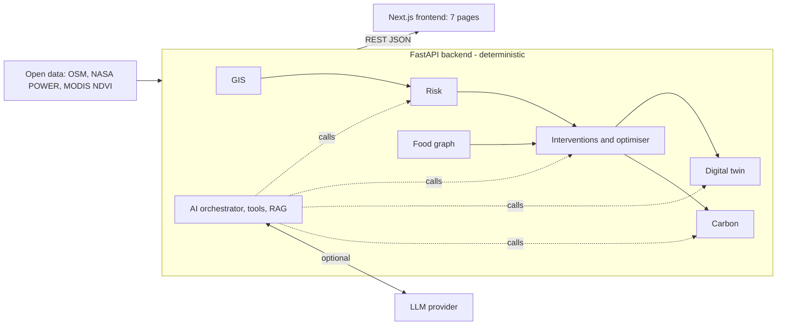

# GeoAI Food-Resilience Digital Twin

**A GIS-centred decision-intelligence platform for the Hyderabad–Telangana food system.**
It senses climate stress, traces how a disruption spreads through the food supply
network, tests interventions, simulates recovery, and explains the result — while
keeping every number deterministic and labeling exactly how far each one can be trusted.

Built by **[Chepa Chaitanya Kireet](https://www.linkedin.com/in/chepa-chaitanya-kireet-47672a2a1/)**
(Project Creator / AI for Sustainability Intern) for the
**1M1B AI for Sustainability Virtual Internship** (in collaboration with IBM SkillsBuild & AICTE), July–Sep 2026.

**Primary SDG:** SDG 2 — Zero Hunger · **Secondary:** SDGs 6, 7, 8, 9, 11, 12, 13, 15, 17
· **Release:** tag [`v1.0-demo`](https://github.com/Chaitanyakireet/geoai-food-resilience-starter/tree/v1.0-demo)

> 📄 **Reviewing this as a submission?** Start with
> [`docs/PROJECT_SUBMISSION.md`](docs/PROJECT_SUBMISSION.md) — problem statement, SDG
> alignment, AI solution overview, target users, Responsible AI considerations,
> expected impact, prototype walkthrough and flow diagrams.

---

## The problem

> *How might we use AI to help planners and food-system decision-makers in
> Hyderabad–Telangana sense climate stress, trace how a disruption spreads through the
> food supply network, and test interventions before committing resources — so that the
> regional food system can become more resilient and sustainable?*

Hyderabad depends on a wider regional network of production areas, markets, storage and
transport. Climate stress and supply disruptions cascade through it, but the signals live
in separate tools, facility-level data is scarce, and most planning tools do not say which
numbers are measured and which are assumed. This project puts those pieces in one spatial,
explainable workspace.

## The core design rule

> **Deterministic tools calculate every number. The AI can explain and orchestrate — it
> cannot invent or override a numeric result.**

Every value in the product carries exactly one of five **truth-status** labels, and
nothing else is allowed:

| Label | Meaning |
|---|---|
| `OBSERVED` | Directly measured in a source dataset (e.g. NASA POWER rainfall, MODIS NDVI). |
| `DERIVED` | Computed deterministically from observed data (e.g. a baseline, a distance). |
| `ESTIMATED` | A disclosed assumption, not measured or fitted (e.g. the risk score, intervention effectiveness). |
| `COUNTERFACTUAL` | A deterministic recompute under a hypothetical (shock) condition. |
| `SIMULATED` | Output of a scenario simulation — not a real-world measurement or forecast. |

## What's in the application

Seven pages, following the loop **Sense → Predict → Diagnose → Reason → Optimise → Simulate → Recover → Verify → Explain → Human review**:

| Page | What it does |
|---|---|
| **Command Center** | State-level overview: mean risk, hotspots, network size, a risk map and a truth-status disclosure. |
| **Spatial Intelligence** | Interactive Leaflet map of Telangana — state, 33 districts, 593 mandals — with a risk layer, search, and a *Why here?* panel (drivers, NDVI context, provenance). |
| **Food Network** | Interactive graph (165 nodes, 318 edges) of production → aggregation → storage → market → demand, with bottleneck analysis and shock propagation. |
| **Intervention Lab** | Compose a shock, test four intervention types, simulate a portfolio or run the multi-objective optimiser; includes the **Carbon & Resource Impact** panel. |
| **Digital Twin** | Baseline / shock / intervention / optimised states, deterministic recovery trajectories and **Compare Worlds** (World A vs World B). |
| **AI Decision Brief** | An AI Copilot that calls approved deterministic tools and cites project evidence, with the tool trace shown beside every answer. |
| **Impact & Responsible AI** | SDG framework (official UN icons), confidence & data coverage, consolidated provenance, Responsible-AI checklist and a human-review boundary. |

### The AI layer

- **Nine approved tools** — `get_risk`, `inspect_location`, `inspect_food_graph`,
  `simulate_shock`, `test_intervention`, `run_optimization`, `calculate_impact`,
  `calculate_carbon_impact`, `retrieve_evidence`.
- **RAG** — deterministic keyword-overlap retrieval over 26 of the project's own
  provenance and methodology documents; it returns `found: false` rather than a loosely
  related match.
- **LLM is optional.** With `ANTHROPIC_API_KEY` set, an LLM orchestrates tools and writes
  the narrative; with no key (or if the call fails) a deterministic, templated fallback
  produces the same tool-grounded summary. The app is fully functional either way.

### Food-system carbon calculator

Deterministic *activity × documented emissions factor*: real great-circle distance between
district/mandal centroids × a cited factor × a stated tonnage. It uses one real factor
(UK BEIS/DEFRA 2021, road freight — a **UK proxy**), uses **straight-line** distance, and
labels results `ESTIMATED`. Cold-chain/storage carbon is reported as **not modeled**
instead of invented. Registry: [`config/carbon_factors.yaml`](config/carbon_factors.yaml).

---

## Tech stack

| Layer | Technologies |
|---|---|
| **Backend** | Python 3.12, FastAPI, Uvicorn, Pydantic, PyYAML |
| **Geospatial** | GeoPandas, Shapely, PyProj, Pyogrio (EPSG:4326) |
| **Graph / analytics** | NetworkX; deterministic risk, resilience, optimisation and recovery models (config-driven YAML) |
| **AI** | Anthropic Messages API via `requests` (optional, env-var configured); tool-calling orchestrator; keyword-overlap RAG |
| **Frontend** | Next.js 16 (App Router, Turbopack), React 19, TypeScript, CSS Modules, Leaflet / react-leaflet |
| **Testing** | pytest (246 tests), TypeScript, ESLint, `next build` |
| **Deployment** | Railway (two services: backend + frontend) |
| **Data** | OpenStreetMap, NASA POWER, NASA MODIS MOD13Q1 NDVI (via AppEEARS) — see [Data sources](#data-sources--attribution) |

### Architecture



## Repository layout

```
backend/
  api/            FastAPI routers (gis, risk, graph, interventions, optimization, twin, ai, carbon)
  geoai/          spatial layer + GIS provenance
  risk/           climate-stress baseline, NDVI context, validation
  graph/          food-network graph, bottlenecks, shock propagation
  intervention/   shock composer, intervention catalog, portfolio engine
  optimization/   multi-objective portfolio optimiser
  resilience/     resilience proxy (distinct from risk)
  twin/           digital twin, recovery model, Compare Worlds
  carbon/         factor registry + deterministic carbon calculator
  ai/             provider abstraction, orchestrator, tools, evidence corpus, fallback
config/           versioned model/assumption/factor YAMLs (project, features, graph, ...)
data/             processed/ datasets + provenance (raw/ is untracked)
scripts/          reproducible data-build scripts (boundaries, climate, NDVI, graph, validation)
frontend/         Next.js application (src/app routes, src/components, src/lib)
tests/            246 pytest tests
docs/             submission document, master handoff, engineering build log
```

## Getting started

### Prerequisites
Python 3.12, Node.js 20+, and (optional) an Anthropic API key for the LLM layer.

### Backend
```bash
python -m venv .venv
# Windows: .venv\Scripts\activate    macOS/Linux: source .venv/bin/activate
pip install -r requirements.txt
python -m uvicorn backend.api.main:app --port 8000
```
Health check: <http://localhost:8000/health> · interactive API docs: <http://localhost:8000/docs>

### Frontend
```bash
cd frontend
npm install
npm run dev
```
Open <http://localhost:3000>. The frontend reads the backend URL from `NEXT_PUBLIC_API_URL`
(default `http://localhost:8000`; see `frontend/.env.local.example`).

### Environment variables
Copy [`.env.example`](.env.example) to `.env` (git-ignored). All values are optional for a
local run.

| Variable | Purpose |
|---|---|
| `ANTHROPIC_API_KEY`, `AI_PROVIDER`, `AI_MODEL` | Enable the LLM Copilot. Unset → deterministic fallback. |
| `CORS_ALLOWED_ORIGINS` | Comma-separated frontend origins allowed in production (localhost is always allowed). |
| `EARTHDATA_USERNAME`, `EARTHDATA_PASSWORD` | Only for re-running the NDVI data-refresh script. |
| `NEXT_PUBLIC_API_URL` *(frontend)* | Backend base URL, baked in at build time. |

No secret is ever committed or returned by an API response.

### Tests and checks
```bash
python -m pytest tests            # 246 backend tests
cd frontend && npx tsc --noEmit && npm run lint && npm run build
```

## API overview

| Router | Key endpoints |
|---|---|
| `/gis` | `/telangana`, `/districts`, `/mandals`, `/location`, `/validate`, `/provenance` |
| `/risk` | `GET /risk?geo_id=…`, `/risk/state`, `/risk/config`, `/risk/provenance`, `/risk/validation-report` |
| `/graph` | `/overview`, `/nodes`, `/edges`, `/bottlenecks`, `POST /propagate`, `/provenance` |
| `/interventions` | `POST /shock`, `POST /test`, `POST /portfolio`, `/catalog`, `/provenance` |
| `/optimization` | `POST /run`, `/config`, `/provenance` |
| `/twin` | `POST /run`, `POST /compare`, `/scenarios`, `/config`, `/provenance` |
| `/carbon` | `/factors`, `POST /calculate`, `POST /compare` |
| `/ai` | `POST /query`, `POST /decision-brief`, `POST /tool`, `/provenance` |

## Data sources & attribution

| Source | Used for | Licence / note |
|---|---|---|
| OpenStreetMap (Overpass, Nominatim) | Boundaries (33 districts, 593 mandals), marketplace POIs | © OpenStreetMap contributors, ODbL |
| NASA POWER | Climate (T2M, T2M_MAX, PRECTOTCORR), 2001–2020 baseline | Public domain; cite NASA POWER |
| NASA LP DAAC MOD13Q1.061 via AppEEARS | NDVI vegetation context | Public-domain NASA data |
| UK Government BEIS/DEFRA GHG Conversion Factors 2021 | Road-freight emissions factor | UK proxy — see carbon disclosures |
| United Nations SDG icons | Impact page | Unmodified; UN disclaimer shown in-app |
| Esri World Dark Gray Base | Map tiles | Esri attribution shown on the map |
| "Sunset at Hussain Sagar" — Lakshayreddy, Wikimedia Commons | Sidebar photo | CC BY-SA 3.0 |

Every dataset's source, access date, licence, processing and limitations are served by the
API (`/*/provenance`) and shown on the *Impact & Responsible AI* page. Data-build steps
are in [`data/README.md`](data/README.md) and `scripts/`.

## Deployment (Railway)

Deployed as **two Railway services** (backend and frontend) with automatic deployments on
push, so every commit to the deployed branch should build cleanly. Things a maintainer must know:

- **`requirements.txt` exists in two places** — the repo root (used by Railway's Python
  build) and `backend/requirements.txt` (local development). The root file is deliberately
  a **self-contained copy** (no `-r backend/...` include, which fails in the build layer).
  **Any dependency change must be made in both files identically.**
- Backend start command: `python -m uvicorn backend.api.main:app --host 0.0.0.0 --port $PORT`.
- Set `CORS_ALLOWED_ORIGINS` on the backend to the deployed frontend origin, and
  `NEXT_PUBLIC_API_URL` on the frontend to the deployed backend URL (build-time variable —
  redeploy after changing it).
- Do not commit secrets; configure keys in Railway's variables UI.

## Responsible AI at a glance

**Fairness** — no personal data; one formula for every district; assumptions labeled
`ESTIMATED` and documented; blind spots (unweighted state mean, ~50 km climate grid) disclosed
in the UI. **Transparency** — five truth-status labels, provenance for every dataset, tool
traces and citations beside AI answers, deterministic fallback. **Ethics** — no fabricated
data, no unsupported causal or carbon claims, human-review boundary, decision *support*
only. **Privacy** — no accounts, tracking or personal data; secrets server-side only.
Full discussion: [`docs/PROJECT_SUBMISSION.md`](docs/PROJECT_SUBMISSION.md#17-responsible-ai-considerations).

## Known limitations

Risk is a transparent **baseline, not a trained model** (no ground-truth disruption data
exists to fit one); climate features are at **district centroids** on a ~50 km grid, and
mandal risk is inherited; most food-graph nodes are **derived or simulated** (only markets
use real OSM data); carbon uses a **UK proxy factor**, **straight-line** distance and
**assumed tonnage**; storage carbon is **not modeled**; outputs are **decision-support
scenarios, not validated forecasts**. See the full list in the submission document.

## Documentation

| Document | Contents |
|---|---|
| [`docs/PROJECT_SUBMISSION.md`](docs/PROJECT_SUBMISSION.md) | Internship deliverable: problem, SDGs, AI overview, users, Responsible AI, impact, demo, diagrams |
| [`docs/MASTER_HANDOFF.md`](docs/MASTER_HANDOFF.md) | Locked project scope and rules (source of truth) |
| [`docs/BUILD_LOG.md`](docs/BUILD_LOG.md) | Original per-milestone engineering log |
| [`data/README.md`](data/README.md) | Data pipeline, provenance and per-dataset limitations |

## Author

**Chepa Chaitanya Kireet** — Project Creator / AI for Sustainability Intern ·
[LinkedIn](https://www.linkedin.com/in/chepa-chaitanya-kireet-47672a2a1/) ·
[GitHub](https://github.com/Chaitanyakireet) ·
[Email](mailto:kireet.chepa@gmail.com)

*Licence: none has been selected yet. Third-party data and assets keep their own licences (above).*
