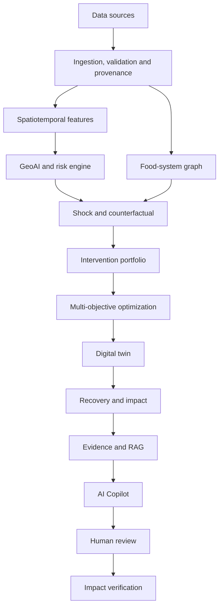

<div align="center">

# GeoAI Food-Resilience Digital Twin

**An AI- and GIS-powered regional food-system resilience platform for Hyderabad–Telangana that estimates environmental risk, traces food-system disruptions, tests interventions, compares scenarios, estimates impacts, and supports evidence-grounded decisions.**


**Live demo:** [geoai-food-resilience.up.railway.app](https://geoai-food-resilience.up.railway.app/) ·
**Repository:** [github.com/Chaitanyakireet/geoai-food-resilience-starter](https://github.com/Chaitanyakireet/geoai-food-resilience-starter) ·
**Release:** [`v1.0-demo`](https://github.com/Chaitanyakireet/geoai-food-resilience-starter/tree/v1.0-demo) ·
**Author:** [Chepa Chaitanya Kireet](https://www.linkedin.com/in/chepa-chaitanya-kireet-47672a2a1/)

<a href="https://geoai-food-resilience.up.railway.app/"></a>

<em>The Command Center of the deployed application (click to open the live demo).</em>

</div>

| | |
|---|---|
| **What** | A web platform that joins a map, environmental data, a food-supply network, intervention testing, optimisation, a scenario simulator and an evidence-citing AI assistant in one decision loop. |
| **Where** | Hyderabad–Telangana, India: 1 state, 33 districts, 593 mandals. |
| **Why** | Regional food systems face interacting climate, environmental and supply-chain disruptions, and the information needed to reason about them sits in separate tools. |
| **How** | GIS + environmental data (NASA POWER climate, MODIS NDVI) + a transparent risk baseline + a food-system graph + interventions + multi-objective optimisation + a scenario-based digital twin + tool-constrained, evidence-grounded AI. |
| **Outcome** | Understand where stress and weak points are, test interventions before committing resources, compare scenarios, and give a human decision-maker a traceable explanation. |
| **SDG** | **SDG 2 — Zero Hunger** (primary). Nine secondary SDGs are classified honestly, see [SDG alignment](#sdg-alignment). |

> **A note on honesty.** This is a **decision-support prototype built from open data**.
> Risk is a transparent *baseline proxy*, not a trained model. Scenario results are
> *simulations under stated assumptions*, not forecasts. Every number carries one of five
> truth-status labels so you can always tell measured from assumed. See
> [Implemented vs modeled vs not modeled](#implemented-vs-modeled-vs-not-modeled) and
> [Current limitations](#current-limitations).

### Reading guide

| If you are… | Start with |
|---|---|
| A non-technical evaluator | [What is this project?](#what-is-this-project) · [Website features](#website-features) · [5-minute demo](#5-minute-demo) · [plain-language guide](docs/HOW_IT_WORKS.md) |
| A sustainability / SDG evaluator | [The problem](#the-problem) · [SDG alignment](#sdg-alignment) · [Responsible AI](#responsible-ai) · [Submission document](docs/PROJECT_SUBMISSION.md) |
| A technical reviewer | [How the system works](#how-the-system-works) · [Risk engine](#risk-engine) · [Food-system graph](#food-system-graph) · [AI Copilot](#ai-copilot) · [Validation and QA](#validation-and-qa) |
| A developer | [Technology stack](#technology-stack) · [Repository structure](#repository-structure) · [Local development](#local-development) · [Deployment](#deployment) |

---

## What is this project?

Food systems can be affected by heat, rainfall deficits, environmental stress, transport
disruptions, storage constraints and other shocks. A decision-maker needs more than a map or
a chatbot. They need to know:

- **where** risk is concentrated,
- **how** a disruption may spread through the food network,
- **which** interventions can be tested, and what trade-offs they create,
- **how** recovery may unfold over time, and
- **why** the system produced a given result.

This project brings those pieces together in one decision loop:

> **Sense → Predict → Diagnose → Reason → Optimize → Simulate → Recover → Verify → Explain → Human Review**

The **"digital twin"** in the name means a computer model of the regional food system that a
planner can experiment on safely. In this project it is a *lightweight, scenario-based*
model, not a live operational replica (see [Digital twin](#digital-twin)).

New to the topic? Read the plain-language walkthrough with a worked example:
**[docs/HOW_IT_WORKS.md](docs/HOW_IT_WORKS.md)**.

## The problem

- Regional food systems face **interacting** environmental, climate, resource and
  supply-chain risks.
- The information is usually **scattered** across separate datasets and tools.
- **GIS shows where** things are, but not what a disruption would cost or what to do about it.
- A **risk score alone** does not tell a user which intervention to test.
- **Optimisation without spatial and network context** can miss where a disruption spreads.
- **AI without evidence or provenance** can sound confident while being wrong.

**The gap this project addresses:** one spatial, explainable workspace that connects
sensing, risk, disruption tracing, intervention testing, optimisation, simulation and
explanation, and that is explicit about how far each number can be trusted.

> **Problem statement (internship format):** *How might we use AI to help planners and
> food-system decision-makers in Hyderabad–Telangana sense climate stress, trace how a
> disruption spreads through the food supply network, and test interventions before
> committing resources, so that the regional food system can become more resilient and
> sustainable?*

## Who it is for

The platform is designed for people who need **regional scenario analysis** of a food system:

| Stakeholder | How they could use it |
|---|---|
| Food-system planners | Spot climate-stressed districts and structural weak points. |
| Sustainability and resilience teams | Compare interventions with their water and carbon trade-offs. |
| Agriculture and environment decision-makers | See the environmental drivers behind a risk estimate, with sources and limits. |
| Supply-chain and logistics planners | Trace how a transport, storage or production disruption propagates and test reroutes. |
| Researchers and analysts | Inspect a transparent, reproducible reference implementation. |
| Policy and support organisations | Use scenario comparisons as one input to discussion. |

> This is a prototype. It is **not** deployed or endorsed by any government or
> organisation, and it has **not** been user-tested with real planners; the audiences above
> are the intended ones.

## Why AI and GeoAI?

"AI is included" is not a reason. Here is what each part is for, and, importantly, which
parts are deterministic code and which are AI.

| Component | Role | Deterministic or AI? |
|---|---|---|
| **GIS / GeoAI** | Connects information to geography; finds spatial patterns; enables drill-down from state to district to mandal. | Deterministic geospatial processing |
| **Environmental / remote-sensing signals** | Describe observed conditions: rainfall and temperature (NASA POWER) and vegetation greenness (MODIS NDVI). | Observed data |
| **Risk engine** | Converts environmental conditions into a transparent risk estimate. | Deterministic formula |
| **Graph reasoning** | Represents production → aggregation → storage → market → demand; traces propagation; finds bottlenecks. | Deterministic graph algorithms |
| **Optimisation** | Compares combinations of interventions under constraints. | Deterministic search |
| **Digital twin** | Compares system states under different scenarios and models recovery. | Deterministic simulation |
| **RAG / evidence** | Retrieves the project's own sources and methodology so explanations can cite them. | Deterministic keyword retrieval |
| **Generative AI (optional LLM)** | **Explains** validated results and **chooses which tools to run**. | **AI** |

> **The rule that shapes the whole project:** deterministic tools calculate every number.
> The AI explains and orchestrates. It does **not** own the arithmetic, and it cannot invent
> or override a numeric result.
>
> There is **no trained machine-learning model** in the current release. That is deliberate:
> no historical food-disruption ground truth exists in open data to train or validate one, so
> reporting model "accuracy" would be fabricated.

## How the system works



| Block | What happens (in simple words) |
|---|---|
| **Data sources** | Open datasets: OpenStreetMap boundaries and market points, NASA POWER climate, NASA MODIS vegetation index, and a published emissions factor. |
| **Ingestion, validation, provenance** | Scripts in `scripts/` build the processed datasets. Geometry is validated, and every dataset gets a provenance record (source, access date, licence, processing, limitations). |
| **Spatiotemporal features** | For each district: the last 30 days of weather compared with the 2001–2020 normal for that time of year, plus a vegetation reading compared with the same season in earlier years. |
| **GeoAI and risk engine** | Turns those features into a 0–1 climate-stress score and a class (low / moderate / high / severe), with confidence, data coverage and drivers. |
| **Food-system graph** | 165 nodes and 318 edges describing production → aggregation → storage → market → demand, with bottleneck analysis. |
| **Shock and counterfactual** | Applies a "what if" (heat, rainfall, production, storage, transport or market disruption) and shows the change. |
| **Intervention portfolio** | Lets you pick from four intervention types and combines their modeled effects. |
| **Multi-objective optimization** | Tries every combination of your candidates, drops those that break your limits, and ranks the rest. |
| **Digital twin** | Holds baseline, shock, intervention and optimised states side by side. |
| **Recovery and impact** | Models how the disruption fades over time and summarises the effect, including carbon. |
| **Evidence and RAG** | Retrieves supporting passages from the project's own sources, or reports that none were found. |
| **AI Copilot** | Runs the approved tools, then explains their results, always showing which tools ran. |
| **Human review** | A person decides. The platform supports the decision; it does not make it. |
| **Impact verification** | The Impact & Responsible AI page gathers SDG alignment, confidence, provenance and the Responsible-AI checklist. |

*Verification also happens throughout (every result carries a truth label and provenance);
the Impact page consolidates it.*

## Core decision loop

| Stage | What it does |
|---|---|
| **Sense** | Observe environmental and spatial conditions. |
| **Predict** | Estimate near-term food-system stress. |
| **Diagnose** | Identify drivers, vulnerable areas and network bottlenecks. |
| **Reason** | Test how shocks and interventions may affect the system. |
| **Optimize** | Compare intervention combinations under constraints. |
| **Simulate** | Run baseline, shock, intervention and recovery scenarios. |
| **Recover** | Model recovery over time. |
| **Verify** | Inspect impacts, provenance and assumptions. |
| **Explain** | Use evidence-grounded AI to explain results. |
| **Human Review** | Keep final consequential decisions with people. |

## Website features

Seven pages plus an always-visible top bar (district and locality search, backend and
AI-provider status, and notifications that only report real conditions).

### 1. Command Center
- **You see:** current situation (risk score, confidence, key drivers, vegetation and water stress), a state risk summary, top-risk districts, network state (nodes, edges, connectivity, bottlenecks), a risk map, and a data-and-provenance panel.
- **It does:** summarises the whole state from backend API calls.
- **Why it matters:** gives an evaluator the overall picture in one screen, with the truth status and risk method stated.

### 2. Spatial Intelligence
- **You see:** an interactive Leaflet map of Telangana with a risk layer and legend, district and mandal boundaries, search, a coordinate lookup, and a location panel.
- **It does:** drills from state to district to mandal and explains *why here?* with drivers, vegetation context, network-bottleneck context and provenance.
- **Why it matters:** GIS is the centre of the product; every result is tied to a place.

### 3. Food Network
- **You see:** a layered diagram (Production → Aggregation → Storage → Market → Demand) with node and edge intelligence, a shock composer, a propagation animation, a mini map, and a provenance drawer.
- **It does:** runs a shock and shows how impact spreads and which nodes are structural bottlenecks; can hand the scenario to the Intervention Lab.
- **Why it matters:** shows how a local disruption can reach the rest of the system.

### 4. Intervention Lab
- **You see:** a geography and food-category picker, a shock composer and result, an intervention catalog, a portfolio with optional constraints, a Carbon & Resource Impact panel, and Simulate / Optimize results.
- **It does:** composes a shock, tests interventions, simulates a portfolio or runs the optimiser, and explains the choice.
- **Why it matters:** lets a planner test options *before* committing resources.

### 5. Digital Twin
- **You see:** baseline, shock (World A), manual-portfolio and optimised (World B) states, KPIs, a recovery chart, recovery metrics, Compare Worlds, an assumptions drawer, and the carbon panel.
- **It does:** runs the scenario over time and compares worlds side by side.
- **Why it matters:** shows consequences and recovery, not just a snapshot.

### 6. AI Decision Brief
- **You see:** a scenario context bar, a generated decision brief with a truth badge per section, a Copilot conversation with suggested prompts, and a sidebar with the **tool trace** and **evidence citations**.
- **It does:** explains the scenario using the approved tools and retrieved evidence.
- **Why it matters:** a readable summary for non-specialists, with every claim traceable.

### 7. Impact & Responsible AI
- **You see:** an interactive SDG framework with the official UN icons, impact summary, Compare Worlds, carbon panel, confidence and data coverage, a truth-status guide, consolidated provenance for all modules, a Responsible-AI checklist, a human-review panel, and a Project & Author card.
- **It does:** audits the scenario end to end.
- **Why it matters:** makes the evidence, assumptions and limits visible in one place.

The scenario (place, food category, shock, interventions) travels between pages inside your
browser session, so you don't re-enter it: Food Network → Intervention Lab → Digital Twin →
AI Decision Brief → Impact.

## GIS and spatial intelligence

GIS is the centre of the project. The current spatial model:

| Item | Value |
|---|---|
| State geometry | 1 (Telangana) |
| Districts | 33 |
| Mandals | 593 |
| Coordinate system | EPSG:4326 |
| Validation | Geometry validity and CRS checks (`GET /gis/validate`) — all layers valid |
| Location lookup | Point-in-polygon: which district and mandal contain a coordinate |

What you can do: explore by district or mandal, toggle the risk layer, read location
intelligence and environmental drivers, look up coordinates, and search by name. Search
covers districts everywhere; Hyderabad-metro mandals (Hyderabad, Medchal–Malkajgiri and Ranga
Reddy) load immediately so places such as **Secunderabad** and **Quthbullapur** are findable.
A short, individually verified list of well-known localities (Hitech City, Gachibowli,
Madhapur, Kondapur, Nanakramguda) resolves to the mandal that contains them and is labeled as
an alias, never as independent geometry.

**Limits, stated plainly**
- Boundaries come from **OpenStreetMap (community-mapped)**, not an official cadastral
  source. The 593 mandals are what OSM resolved at the time; this is **not confirmed to be the
  complete official gazetted set**. The preferred government source (TGRAC) was unreachable
  during the build.
- **No parcel-level precision** is claimed.
- Climate values are **district-centroid** points on a coarse grid (see below); mandals
  **inherit** their parent district's risk and are flagged as such.
- The top-bar search covers districts and the short locality list; mandal-level search lives
  inside Spatial Intelligence.

## Environmental and remote-sensing data

| Data | What it is | Role |
|---|---|---|
| **NASA POWER** | Daily temperature (T2M, T2M_MAX) and precipitation (PRECTOTCORR) at each district centroid; 2001–2020 monthly normals as the baseline. | Drives the risk score. |
| **MODIS NDVI** | Vegetation greenness (MOD13Q1.061, 250 m, 16-day composites via NASA AppEEARS), quality-filtered, compared with the same season in earlier years. | Observed context indicator. |

**NASA POWER resolution.** Its native grid is about 0.5° (~50 km), coarser than many
districts. Neighbouring districts can therefore share identical rainfall and heat readings.
The app names the districts that share a grid cell and says this is a data limit, not a
computation error.

**Snapshot, not live.** The processed data are dated snapshots. The current climate window is
30 days ending 2026-09-14, fetched 2026-09-17. NDVI was fetched 2026-09-19, and each
district's latest usable 16-day composite is dated between 2026-06-10 and 2026-08-29 (cloudy
composites are excluded, so some lag behind others). The app does not stream live data;
scripts refresh it.

> **NDVI is displayed as an observed environmental indicator and is not currently folded
> directly into the risk score because a validated weighting was not established.**
>
> NDVI readings are labeled `OBSERVED`; the seasonal baseline they are compared with is
> labeled `DERIVED`. Only pixels flagged Good or Marginal are kept (snow/ice and cloudy pixels
> are excluded), and the baseline uses a ±24-day same-season window over about six years.

## Risk engine

The system estimates **climate-driven food-system stress** with a **transparent, deterministic
baseline** rather than pretending to have a validated machine-learning food-insecurity
predictor where historical labels don't exist.

- **Inputs:** how far recent **rainfall is below** its normal (30 % below = full stress) and how far
  **temperature is above** its normal (15 % above = full stress).
- **Blend:** 60 % rainfall deficit + 40 % heat stress → a score from 0 to 1 → *low* (≤0.25),
  *moderate* (≤0.50), *high* (≤0.75) or *severe*.
- **Every weight and threshold** is in [`config/features.yaml`](config/features.yaml), not hidden in code.
- **Outputs:** score, class, confidence, uncertainty interval, major drivers (each marked as
  used in the score or context-only), data coverage, model version and truth status
  (`ESTIMATED`).
- **Refuses to guess:** with too little data coverage it returns `insufficient_data`.
- The maximum-temperature anomaly is computed but **excluded** from the score because its
  baseline is not confirmed to be the same statistic.

> The risk score is an **estimate of climate stress, not a direct measurement of food
> insecurity**. No accuracy figure is reported because there is no ground truth to compute one;
> a diagnostics report (spatial smoothness, temporal spot-check, leakage checks) is in
> `data/processed/risk_validation_report.json`.

## Food-system graph

The regional food chain is modeled as a directed network. Every district has five nodes,
`production → aggregation → storage → market → demand`, giving **33 × 5 = 165 nodes**. There
are **318 edges**: 132 chain links inside districts, 154 **transport links** between
neighbouring districts, and 32 supply links into Hyderabad (the principal demand hub).
*Transport is represented as links between districts, not as separate nodes.*

**Bottleneck logic, simply.** A node is flagged as a structural bottleneck *candidate* if it is
an **articulation point** (removing it cuts part of the network off), or has high
**betweenness** (many routes pass through it), or high **in-degree** (many things depend on
it). These are structural properties, not proof of real-world importance.

**Shock propagation, simply.** Apply a shock to one node. Its impact flows downstream; each hop
keeps **60 %** of the previous impact, stopping below 2 % or after five hops. If a node is
reached by several paths it keeps the largest impact. Results are always `SIMULATED`.

**Honest scope.** The graph, its API, bottleneck analysis, propagation and the interactive
Food Network page all work. The *data* behind the graph are limited:
- Only **market nodes** use real data (OpenStreetMap marketplaces for **29 of 33** districts;
  the rest are labeled `SIMULATED` placeholders).
- Production nodes are real districts with **no real volumes**; aggregation, storage and most
  demand nodes are **simulated placeholders**.
- **No edge carries a real flow, price or capacity.** AGMARKNET/e-NAM, warehousing (FCI/state)
  and state production statistics were sought but could not be obtained.
- Propagation models directional dependency only; it does not model substitution, buffering
  or elasticity.

This is **not** a full operational supply-chain replica.

## Shock composer

Users can test scenarios such as:

| Shock | Kind | Label |
|---|---|---|
| Heat change (°C) | Climate | `COUNTERFACTUAL` (risk recomputed under the hypothetical) |
| Rainfall change (%) | Climate | `COUNTERFACTUAL` |
| Production disruption | Graph | `SIMULATED` propagation |
| Storage capacity reduction | Graph | `SIMULATED` |
| Transport capacity reduction | Graph | `SIMULATED` |
| Market demand disruption | Graph | `SIMULATED` |

The backend accepts combinations; the Intervention Lab pairs one graph shock with optional
climate fields. These are **scenario inputs, not observed reality**, and are never labeled as such.

## Interventions

Four intervention types ship in [`config/interventions.yaml`](config/interventions.yaml) (more can be added without code changes):

| Intervention | Idea | Assumed effectiveness |
|---|---|---|
| Alternative sourcing | Source from a less-affected district | 35 % |
| Storage redistribution | Shift buffer stock toward the affected area | 30 % |
| Route diversification | Route around a shocked link | 40 % |
| Resource efficiency | Reduce loss and spoilage along the chain | 15 % |

- Effectiveness defaults are **illustrative assumptions** (`ESTIMATED`), not measured or
  field-validated; you can override them.
- Cost, water, carbon and loss-reduction figures stay **"unknown" unless you supply them**.
- Interventions on the same shock combine as `1 − ∏(1 − eᵢ)`, which assumes they are
  independent; real synergies or conflicts are not modeled.
- Results are **modeled effects, never measured real-world impacts**.

## Optimization

The optimiser compares **combinations** of interventions rather than picking one action.

- It evaluates every non-empty subset of up to 8 candidates (at most 255), checks your
  **constraints** (budget, water, carbon, feasibility) and ranks the feasible ones.
- Objectives: modeled **food availability** and **resilience** (primary); **food loss**, **cost**,
  **water** and **carbon** (secondary, only where you supplied values).
- Weights are disclosed assumptions (`config/optimization.yaml`); the **raw, unweighted
  numbers for every candidate are always shown** with a Pareto flag, so the ranking is one lens.
- If nothing satisfies your constraints it selects **nothing** rather than an infeasible option.

This is deterministic scenario optimisation. A "selected" portfolio means *modeled best under
the configured objectives and constraints*, **not a proven optimal real-world policy**.

## Digital twin

In this project, "digital twin" means a **lightweight, scenario-based computational model** of
the regional food system with these states:

`Baseline` (no shock) · `Shock` · `Intervention` (your portfolio) · `Optimized` (the optimiser's pick) · `Recovery` over time

It supports four scenario types: **A** baseline, **B** shock only, **C** shock + optimised
portfolio, **D** shock + manual portfolio, at district, mandal or state-level (baseline only)
resolution. It is **not** a fully calibrated live operational replica.

**Compare Worlds**

| | Meaning |
|---|---|
| **World A** | The shock happens and **no intervention** is applied. |
| **World B** | The shock happens and the **optimised (or selected) portfolio** is applied. |

It compares demand impact, resilience score and gap, food-availability effect, food-loss
effect, water, carbon, cost, recovery time and residual impact. Cost, water and carbon appear
only where you supplied them, and are shown as neutral resource accounting, not as good/bad.

*Worked example (real run, checkable by hand):* a 50 % production shock at Hyderabad decays to
6.48 % demand impact after four hops (0.5 × 0.6⁴). "Alternative sourcing" at 35 % lowers it to
4.21 %, a change of −0.0227, with a slightly higher resilience score and about 7 days faster
recovery. All `SIMULATED`.

## Recovery

Resilience is not only avoiding disruption; it is also how quickly a system recovers. The twin
models disruption fading exponentially at an **assumed 5 % per day** in 7-day steps over a
90-day horizon, and reports:

- peak and final disruption,
- **time to reach a defined service threshold** (residual impact below 5 %),
- recovery fraction and residual impact,
- resilience gap before and after.

The recovery rate is **not fitted to any observed Telangana recovery event**. All modeled
recovery is labeled `SIMULATED`. Each metric is defined in the result payload itself.

## Carbon impact

A deterministic carbon capability that is **part of the scenario decision system**, not a
generic standalone calculator. It estimates the transport carbon of a specific
rerouting/alternative-sourcing intervention, and appears in the Intervention Lab, the Digital
Twin, the Impact page, and as an AI tool.

**How it works:** `distance × emission factor × tonnes moved`.
- Distance: great-circle distance between real district/mandal centroids (`DERIVED`).
- Factor: UK Government BEIS/DEFRA 2021, HGV rigid >17 t, average laden, well-to-wheel:
  **0.04401 kg CO₂e per tonne-km**, from a registry ([`config/carbon_factors.yaml`](config/carbon_factors.yaml)) with source, unit, geography, year, method and limitations.
- Tonnage: an explicit user assumption. Without it, only carbon intensity (kg per tonne) is shown.
- Comparison: baseline (no intervention, 0 kg by definition) vs scenario; **% change is shown
  only when mathematically valid**, never from a zero baseline.

**Current limitations (not hidden)**
- The factor is a **UK proxy**; no India-specific road-freight factor was sourced.
- Distance is **straight-line**, not road-network routing.
- **Cold-chain / storage carbon is `not_modeled`**; the calculator returns "unavailable" with a
  reason instead of a number.
- Results are `ESTIMATED` (tonnage is an assumption). Do not read them as *measured carbon
  reductions*.
- The result is shown alongside the optimiser but is **not automatically fed** into its carbon
  objective, which continues to use figures you supply.

## AI Copilot

One visible AI Copilot orchestrates **nine approved tools**, each a thin wrapper over an existing deterministic engine:

| Tool | What it does |
|---|---|
| `get_risk` | Climate-stress risk for a district or mandal. |
| `inspect_location` | Geography + risk + resilience for a place. |
| `inspect_food_graph` | Network summary and bottlenecks. |
| `simulate_shock` | Compose a shock; baseline vs shocked risk, resilience, propagation. |
| `test_intervention` | One intervention against one graph shock. |
| `run_optimization` | Search intervention combinations under constraints. |
| `calculate_impact` | Run the digital twin (states, recovery, impact). |
| `calculate_carbon_impact` | Deterministic transport-carbon comparison. |
| `retrieve_evidence` | Retrieve supporting project evidence. |

**Hard rules**
- The LLM **does not own authoritative arithmetic** and is given no way to compute or change numbers.
- It **cannot invent or override** validated numerical outputs; the interface shows the tool
  results separately from its prose, so any mismatch is visible.
- It **cannot cite evidence it did not retrieve**: the citation cards come from actual retrieval
  results, and the prompt forbids inventing sources.
- Modeled, counterfactual and simulated outputs **must stay labeled** as such.

**Deterministic fallback.** With no provider configured (or if the provider call fails) the
application still works completely: the same tools run and a fixed template summarises their
results, clearly labeled a "structured system brief". In QA the answer text matched the tool
trace exactly. The LLM is optional and configured only through environment variables
(`ANTHROPIC_API_KEY`); no secret is ever returned by the API.

## RAG and evidence

- **Corpus:** 26 documents built from the project's own dataset registries (GIS, climate,
  NDVI, food graph), methodology and assumption disclosures (risk, interventions, optimiser,
  twin), and the master specification.
- **Retrieval:** deterministic keyword-overlap matching (not semantic or embedding search).
- **Each match carries:** source name, URL and access date where available, truth status, an
  excerpt, a relevance score and the matched terms.
- **No fabrication:** if nothing matches, it returns `found: false` and says no supporting
  evidence was found.
- **Red-teamed:** QA found and fixed a false-positive where generic filler words could cause a
  nonsense query to "match" a real document. It now returns `found: false`, and a regression test
  covers it.

## Truth-status system

Every value shown carries exactly one of five labels, and nothing else is allowed:

| Label | In simple words | Example |
|---|---|---|
| `OBSERVED` | Directly measured in a source dataset. | NASA rainfall, MODIS NDVI reading |
| `DERIVED` | Computed deterministically from observed data. | Seasonal baseline, distance, state boundary |
| `ESTIMATED` | A disclosed assumption, not measured or fitted. | Risk score, "35 % effective" |
| `COUNTERFACTUAL` | A deterministic recompute under a hypothetical. | Risk under a +2 °C heat shock |
| `SIMULATED` | Output of a scenario simulation, not a measurement or forecast. | Shock spread, recovery curve |

This keeps observation, derivation, assumption and simulation from being mistaken for one another.

## Responsible AI

- **Provenance:** every dataset records source, access date, licence, processing and limitations;
  seven provenance endpoints are consolidated on the Impact page, including sources that were
  *sought but not obtained*.
- **Uncertainty and limitations:** confidence, data coverage and per-result limitation lists are
  returned by the API and shown.
- **Transparency:** tool traces and citations sit beside AI answers; the optimiser's explanation
  uses no LLM.
- **Human review:** consequential decisions stay with people. The "reviewed" control is local
  browser state and is stated not to be institutional approval.
- **No hallucinated quantitative authority:** the AI cannot originate numbers.
- **No unsupported causal claims:** effectiveness values are labeled illustrative and no
  intervention is claimed to be field-validated.
- **Separation:** measured, derived, estimated, counterfactual and simulated information is
  always kept apart.
- **Privacy:** no accounts, tracking or personal data; secrets stay server-side.
- **Fairness:** one formula for every district, assumptions disclosed, and known blind spots
  (unweighted state mean, ~50 km grid, no vulnerability or demographic data) surfaced.

**Why this matters:** sustainability decisions can direct real resources. Decision support is
only useful if people can tell what was measured, what was assumed and what was simulated.
Full discussion: [docs/PROJECT_SUBMISSION.md](docs/PROJECT_SUBMISSION.md#17-responsible-ai-considerations).

## SDG alignment

### Primary SDG: SDG 2 — Zero Hunger
The platform is about keeping food available and accessible when climate stress or supply-chain
disruption hits a regional food system: risk estimation, disruption tracing, intervention
testing and modeled food-availability effects. This is the resilience side of ending hunger.

### Secondary SDGs

| SDG | Classification | Notes |
|---|---|---|
| **13 Climate Action** | **Directly supported** | Rainfall and heat-stress risk; carbon estimate for interventions. |
| **9 Industry, Innovation & Infrastructure** | Indirect / co-benefit | Supply-network and infrastructure bottleneck analysis; route diversification. |
| **11 Sustainable Cities & Communities** | Indirect / co-benefit | Hyderabad is modeled as the principal demand hub. |
| **6 Clean Water & Sanitation** | Contextual, scenario-dependent | Shown as a co-benefit only when a scenario supplies a water figure; otherwise not modeled. |
| **12 Responsible Consumption & Production** | Contextual, scenario-dependent | Only when a scenario supplies a food-loss effect; otherwise not modeled. |
| **7 Affordable & Clean Energy** | Not directly modeled | Declared secondary; no output touches it. |
| **8 Decent Work & Economic Growth** | Not directly modeled | Livelihoods and labour are not modeled. |
| **15 Life on Land** | Not directly modeled | Ecosystems and biodiversity are outside current scope. |
| **17 Partnerships for the Goals** | Not directly modeled | No output touches it. |

> This is a **project-alignment map, not proof of achievement**. The project does not directly
> measure every SDG, and no goal is scored numerically. The Impact page shows the same
> classification with the official UN icons.

## Data sources and provenance

Derived from the repository's own registries (`data/processed/*provenance.json`, served live at
`/gis/provenance`, `/risk/provenance`, `/graph/provenance`).

| Data family | Source | Role | Status / limitation |
|---|---|---|---|
| Administrative boundaries (state, 33 districts, 593 mandals) | OpenStreetMap contributors via Overpass API and Nominatim (relation "Telangana"); accessed 2026-09-17; ODbL | GIS base layer, location lookup | Community-mapped, not official cadastral; official TGRAC source unreachable; state boundary is `DERIVED` from districts |
| Climate observations | NASA POWER daily point API; public domain (cite NASA POWER) | Risk score input (30-day window) | `OBSERVED`; ~0.5° (~50 km) grid, district centroid point |
| Climate baseline | NASA POWER 2001–2020 monthly climatology | Baseline for anomalies | `OBSERVED`; does not capture recent trends outside the window |
| Vegetation (NDVI) | NASA LP DAAC MODIS Terra MOD13Q1.061 via AppEEARS; public domain, Earthdata login to refresh; accessed 2026-09-19 | Context indicator | `OBSERVED` reading, `DERIVED` baseline; **not used in risk score**; 250 m at district centroid |
| Food markets | OpenStreetMap marketplace points of interest via Overpass; ODbL; accessed 2026-09-17 | Market nodes | `OBSERVED`; 29 of 33 districts; community-mapped |
| Transport backbone | Derived from the district layer | Between-district links | `DERIVED`; modeled connectivity, not real routes, distance or capacity |
| Emissions factor | UK Government BEIS/DEFRA GHG Conversion Factors 2021 ([source](https://www.gov.uk/government/publications/greenhouse-gas-reporting-conversion-factors-2021)) | Carbon calculator | UK proxy; see [Carbon impact](#carbon-impact) |
| Evidence corpus | The project's own provenance, methodology and specification documents | RAG retrieval | Keyword retrieval over 26 documents |

**Sought but not obtained:** AGMARKNET / e-NAM market data, Telangana State Warehousing /
FCI storage data, and Telangana DES production statistics. They are recorded as such in
`/graph/provenance`.

**Other assets:** official UN SDG icons (unmodified, with the UN's required disclaimer shown
in-app); Esri World Dark Gray Base map tiles; sidebar photograph
["Sunset at Hussain Sagar"](https://commons.wikimedia.org/wiki/File:Sunset_at_Hussain_Sagar.jpg)
by Lakshayreddy (CC BY-SA 3.0).

## Implemented vs modeled vs not modeled

| Capability | Current status | What it means |
|---|---|---|
| Administrative boundaries | **Real data** (`OBSERVED`) | Community-mapped OSM geometry; validated, EPSG:4326 |
| Climate (rain, temperature) | **Real data** (`OBSERVED`) | NASA POWER snapshot at district centroids |
| Vegetation (NDVI) | **Real data** (`OBSERVED` + `DERIVED` baseline) | Shown as context; not in the risk score |
| Risk score | **Modeled estimate** (`ESTIMATED`) | Deterministic proxy with assumed weights; not validated against outcomes |
| Location lookup, distances | **Deterministic calculation** (`DERIVED`) | Same input, same output |
| Market nodes | **Partly real** (`OBSERVED`) | 29 of 33 districts from OSM; others simulated |
| Other graph nodes and all edges | **Modeled / simulated** | Placeholders; no real volumes or capacities |
| Bottleneck detection | **Deterministic calculation** | Structural candidates only |
| Climate shocks (heat, rainfall) | **Counterfactual** | Risk recomputed under a hypothetical |
| Graph shocks and propagation | **Simulation** (`SIMULATED`) | Constant-decay cascade; assumed |
| Intervention effects | **Modeled estimate** (`ESTIMATED`) | Illustrative defaults; independence assumed |
| Optimisation | **Deterministic scenario search** | Modeled best under stated objectives |
| Recovery and Compare Worlds | **Simulation** (`SIMULATED`) | Assumed 5 %/day recovery; not calibrated |
| Transport carbon | **Deterministic + estimate** | Intensity `DERIVED`; total `ESTIMATED` (assumed tonnage, UK factor) |
| AI explanations | **Tool-constrained** | Narrates tool results; cannot originate numbers |
| Food insecurity measurement | **Not modeled** | Risk is a proxy only |
| Real flows, prices, capacities, stocks | **Not modeled** | Data not obtainable openly |
| Population, nutrition, vulnerability, income | **Not modeled** | No demographic data used |
| Category-specific sensitivity | **Not modeled** | Same climate proxy for every food category |
| Cold-chain / storage carbon | **Not modeled** | Reported as unavailable |
| Road-network routing | **Not modeled** | Straight-line distance used |
| Live / real-time data | **Not implemented** | Dated snapshots refreshed by scripts |
| Calibration to real recovery events | **Not modeled** | No such dataset available |

## Current limitations

Verified against the current implementation:

**Data and GIS**
- NASA POWER's ~50 km grid is coarse; nearby districts can share readings; values are
  district-centroid points; mandals inherit their district.
- Data are dated snapshots (climate window ends 2026-09-14), not real time.
- Boundaries are open/community-mapped; the 593-mandal set is not confirmed to be the complete
  official one; no parcel-level precision.
- Top-bar search covers districts and a short verified locality list; mandal search is in
  Spatial Intelligence.

**Models**
- Risk is a baseline proxy with assumed weights, not validated against outcomes; the same
  proxy applies to every food category; NDVI is not in the score.
- Most of the food graph is modeled or simulated; no real flows, prices or capacities.
  The Food Network page is a layered diagram of that modeled network, not a geo-positioned supply map.
- Propagation is a constant-decay directional model without substitution, buffering or elasticity.
- Intervention effectiveness values are illustrative; the optimiser is limited to 8
  candidates and uses assumed weights.
- The twin is a **scenario-based computational twin**, not a fully calibrated operational one;
  recovery rate is assumed.

**Carbon**
- UK proxy factor; straight-line distance; assumed tonnage; storage/cold-chain carbon not
  modeled; not wired into the optimiser's carbon objective; carbon documentation is not
  indexed in the RAG corpus.

**AI**
- Evidence retrieval is keyword-based, not semantic.
- The live-LLM code path is covered by tests using a fake provider; it was **not exercised
  against a live API key** during QA. Only an Anthropic adapter exists (no IBM Granite).

**Project**
- Not user-tested with real planners; no automated browser/UI tests; no `LICENSE` file yet.

## Technology stack

Taken from `requirements.txt`, `backend/requirements.txt` and `frontend/package.json`.

| Category | Technologies |
|---|---|
| **Frontend** | Next.js 16.3.5 (App Router, Turbopack), React 19.2.8, TypeScript 5, CSS Modules, `next/font` (Space Grotesk, IBM Plex Sans, IBM Plex Mono) |
| **Maps** | Leaflet 1.9, react-leaflet 5, Esri World Dark Gray Base tiles |
| **Backend** | Python 3.12, FastAPI 0.115.6, Uvicorn 0.34.0, Pydantic (via FastAPI), PyYAML 6.0.2, Requests 2.32.3 |
| **GIS / geospatial** | GeoPandas 1.1.4, Shapely 2.1.2, PyProj 3.7.2, Pyogrio 0.11.1 (EPSG:4326, GeoJSON) |
| **Graph analysis** | NetworkX 3.6.1 |
| **Optimisation** | Custom brute-force multi-objective search (standard library; no solver dependency) |
| **AI / RAG** | Optional Anthropic Messages API via Requests; custom tool-calling orchestrator; keyword-overlap retrieval (no vector database) |
| **Data** | OpenStreetMap (Overpass, Nominatim), NASA POWER API, NASA AppEEARS (MODIS NDVI); processed JSON/GeoJSON in `data/processed/` |
| **Testing and quality** | pytest 8.3.4, HTTPX test client, TypeScript compiler, ESLint 9 (`eslint-config-next`) |
| **Deployment** | Railway (two services: backend and frontend) |

## Repository structure

```
.
├── backend/
│   ├── api/             FastAPI routers: gis, risk, graph, interventions, optimization, twin, ai, carbon
│   ├── geoai/           spatial layer and GIS provenance
│   ├── risk/            climate-stress baseline, NDVI context, validation, provenance
│   ├── graph/           food-system graph, bottlenecks, shock propagation
│   ├── intervention/    shock composer, intervention catalog, portfolio engine
│   ├── optimization/    multi-objective portfolio optimiser
│   ├── resilience/      resilience proxy (kept distinct from risk)
│   ├── twin/            digital twin, recovery model, Compare Worlds
│   ├── carbon/          emissions-factor registry and calculator
│   ├── ai/              provider abstraction, orchestrator, tools, evidence corpus, fallback
│   ├── core/            project config loader
│   └── requirements.txt
├── config/              project.yaml, features.yaml, graph.yaml, resilience.yaml,
│                        interventions.yaml, optimization.yaml, twin.yaml, carbon_factors.yaml
├── data/
│   ├── processed/       tracked datasets + provenance registries (raw/ is untracked)
│   └── README.md        data pipeline and per-dataset limitations
├── docs/
│   ├── HOW_IT_WORKS.md          plain-language guide with a worked example
│   ├── PROJECT_SUBMISSION.md    internship deliverable
│   ├── MASTER_HANDOFF.md        locked scope and rules (source of truth)
│   ├── MASTER_HANDOFF_FULL.docx full project plan
│   ├── BUILD_LOG.md             original per-milestone engineering log
│   └── screenshots/             application screenshots used in the docs
├── frontend/
│   ├── src/app/         seven routes (/, /spatial, /network, /interventions, /twin, /ai-brief, /impact)
│   ├── src/components/  UI components by area (spatial, network, interventions, twin, ai-brief, impact, command)
│   ├── src/lib/         API client, mappings, author config, SDG framework
│   └── public/          logo, sidebar photo, official UN SDG icons
├── scripts/             reproducible data builds: spatial layer, climate, NDVI, food graph, risk validation
├── tests/               pytest suite (246 tests)
├── requirements.txt     self-contained backend dependencies for Railway (must mirror backend/requirements.txt)
├── .env.example         backend environment variables (values blank)
├── CLAUDE_BOOTSTRAP.md  builder bootstrap notes from the build phase
└── src/, web/           superseded placeholders, kept for history (see their READMEs)
```

## Local development

**Prerequisites:** Python 3.12, Node.js ≥ 20.9 (required by Next.js 16), and optionally an
Anthropic API key for the LLM layer.

**Backend** (from the repository root)
```bash
python -m venv .venv
# Windows: .venv\Scripts\activate      macOS/Linux: source .venv/bin/activate
pip install -r requirements.txt
python -m uvicorn backend.api.main:app --port 8000
```
Health check: <http://localhost:8000/health> · API docs: <http://localhost:8000/docs>

**Frontend**
```bash
cd frontend
npm install
npm run dev
```
Open <http://localhost:3000>. The frontend reads `NEXT_PUBLIC_API_URL` (default
`http://localhost:8000`; see `frontend/.env.local.example`).

**Environment variables.** Copy [`.env.example`](.env.example) to `.env` (git-ignored). All
are optional for a local run.

| Variable | Purpose |
|---|---|
| `ANTHROPIC_API_KEY`, `AI_PROVIDER`, `AI_MODEL` | Enable the LLM Copilot. Unset → deterministic fallback. |
| `CORS_ALLOWED_ORIGINS` | Comma-separated frontend origins allowed in production (localhost always allowed). |
| `EARTHDATA_USERNAME`, `EARTHDATA_PASSWORD` | Only to re-run the NDVI refresh script. |
| `NEXT_PUBLIC_API_URL` *(frontend)* | Backend base URL, baked in at build time. |

**Tests, type-check, lint, build**
```bash
python -m pytest tests                                   # 246 backend tests
cd frontend
npx tsc --noEmit                                         # TypeScript check
npm run lint                                             # ESLint
npm run build                                            # production build
```

**Rebuild datasets** (needs network access): `python scripts/build_spatial_layer.py`,
`build_climate_features.py`, `build_food_graph.py`, `validate_risk_baseline.py`, and
`build_vegetation_features.py` (needs Earthdata credentials). Details: [`data/README.md`](data/README.md).

## Deployment

The project is deployed on **Railway as two services** (backend and frontend), with automatic
deployments on push. The frontend is live at
**<https://geoai-food-resilience.up.railway.app/>**. For maintainers:

- **`requirements.txt` exists in two places** (repository root, used by the Railway Python
  build, and `backend/requirements.txt`). The root file is a deliberately **self-contained
  copy**; any dependency change must be made in **both**, identically.
- Backend start command: `python -m uvicorn backend.api.main:app --host 0.0.0.0 --port $PORT`.
- Set `CORS_ALLOWED_ORIGINS` (backend) to the deployed frontend origin and
  `NEXT_PUBLIC_API_URL` (frontend) to the deployed backend URL. The latter is a build-time
  variable, so redeploy after changing it.
- Keep secrets in Railway's variables UI. Nothing secret is committed.

## 5-minute demo

| # | Screen | Show | Say (simply) |
|---|---|---|---|
| 1 | **Command Center** | State risk summary, top-risk districts | "This is the whole state at a glance, and every number says how far to trust it." |
| 2 | **Spatial Intelligence** | Click a district; search *Secunderabad*; open *Why here?* | "Risk is tied to a place. Here are the drivers, the vegetation context and the sources." |
| 3 | **Food Network** | Pick a node, view bottlenecks | "This is the supply chain as a network. Some nodes are weak points." |
| 4 | **Shock Composer** | Apply a production shock; run propagation | "If supply drops here, the impact travels downstream and fades." |
| 5 | **Intervention Portfolio** | Add *Alternative sourcing* and *Resource efficiency* | "These are options to test. Their effectiveness is an assumption and is labeled so." |
| 6 | **Optimization** | Press Optimize | "It tries every combination within my limits and shows why it picked one." |
| 7 | **Digital Twin / Compare Worlds** | Run, then Compare Worlds | "World A is no action; World B is with the plan. Here is what changes and how fast we recover." |
| 8 | **Trade-offs** | Carbon & Resource Impact panel | "Rerouting has a carbon cost. This uses a cited factor and says exactly what is assumed." |
| 9 | **AI Decision Brief** | Generate the brief; open the tool trace | "The AI explains, but the numbers come from these tools, and I can see them." |
| 10 | **Impact & Responsible AI** | SDG framework, provenance, checklist | "Here are the goals it supports, what is measured versus assumed, and where a human decides." |

## Validation and QA

Re-verified on 2026-09-21 on top of the `v1.0-demo` release, using the repository's own commands:

| Check | Result |
|---|---|
| Backend tests (`python -m pytest tests`) | **246 passed** |
| TypeScript (`npx tsc --noEmit`) | Clean |
| ESLint (`npm run lint`) | Clean |
| Production build (`npm run build`) | Succeeds; all 7 routes compile |
| GIS validation | 1 state, **33 districts**, **593 mandals**, EPSG:4326, all geometry valid |
| Graph validation | **165 nodes, 318 edges** |
| Routes | All 7 return HTTP 200 (verified in the demo-freeze pass) |
| API smoke tests | All major endpoints across gis, risk, graph, interventions, optimization, twin, ai and carbon return 200 (demo-freeze pass) |
| Numerical chain | risk → shock → intervention → optimization → twin → impact verified end to end with correct truth labels |
| AI tools | All **9 tools** invoke correctly; deterministic fallback verified with no provider configured |
| AI grounding | Answer text matched the tool trace exactly; an evidence-retrieval false positive was **found and fixed** with a regression test |
| Truth-status audit | Only the five canonical labels appear anywhere in backend or frontend source |
| NDVI | 33/33 districts, quality-filtered, `OBSERVED`/`DERIVED` labeled, confirmed **not** in the risk score at district or mandal level |
| Carbon | 26 dedicated tests: arithmetic, units, missing factor, provenance, edge cases, API |
| Secrets | None committed; `.env` git-ignored; `.env.example` blank |

**Not covered by QA:** a live LLM call, visual and mobile layout in a real browser, automated
UI tests, and user testing.

## Design and scientific principles

- **No fabrication:** missing data is reported as unavailable or not modeled, never invented.
- **Provenance first:** every dataset and result traces to a source.
- **Deterministic numerical calculations:** same input, same output.
- **AI explains, not invents.**
- **Observed ≠ estimated ≠ simulated.**
- **Correlation ≠ causation:** no unsupported causal claims.
- **Human review** for consequential decisions.
- **Transparent uncertainty:** confidence and coverage are shown.
- **Honest limitations:** they are stated wherever they apply.

## Project creator

**Chepa Chaitanya Kireet** — Project Creator / AI for Sustainability Intern, 1M1B AI for
Sustainability Virtual Internship (in collaboration with IBM SkillsBuild & AICTE).

Set the project's scope and design decisions and directed and approved its implementation. The
code was written with AI coding assistants (Claude and ChatGPT) working under that direction, as
recorded in [`docs/MASTER_HANDOFF.md`](docs/MASTER_HANDOFF.md).

[LinkedIn](https://www.linkedin.com/in/chepa-chaitanya-kireet-47672a2a1/) ·
[GitHub](https://github.com/Chaitanyakireet) ·
[Project repository](https://github.com/Chaitanyakireet/geoai-food-resilience-starter) ·
[Email](mailto:kireet.chepa@gmail.com)

## Documentation

| Document | Contents |
|---|---|
| [`docs/HOW_IT_WORKS.md`](docs/HOW_IT_WORKS.md) | Plain-language guide, worked example, glossary, FAQ |
| [`docs/PROJECT_SUBMISSION.md`](docs/PROJECT_SUBMISSION.md) | Internship deliverable: problem, SDGs, AI overview, Responsible AI, impact, demo |
| [`docs/MASTER_HANDOFF.md`](docs/MASTER_HANDOFF.md) | Locked project scope and rules (source of truth) |
| [`docs/BUILD_LOG.md`](docs/BUILD_LOG.md) | Original per-milestone engineering log (historical) |
| [`data/README.md`](data/README.md) | Data pipeline, provenance and per-dataset limitations |

## Acknowledgements and references

- **1M1B AI for Sustainability Virtual Internship**, *Project Creation & Guideline Document*
  (in collaboration with IBM SkillsBuild & AICTE), July–Sep 2026. The structure of the
  submission follows this guide (supplied through the internship, not redistributed here).
- **Project specification:** [`docs/MASTER_HANDOFF.md`](docs/MASTER_HANDOFF.md) and `docs/MASTER_HANDOFF_FULL.docx`.
- **UN Sustainable Development Goals:** <https://www.un.org/sustainabledevelopment>. The content
  of this project has not been approved by the United Nations and does not reflect the views of
  the United Nations or its officials or Member States.
- **NASA POWER:** <https://power.larc.nasa.gov/docs/methodology/> · **NASA AppEEARS / LP DAAC MODIS:** <https://appeears.earthdatacloud.nasa.gov/api/>
- **OpenStreetMap contributors** (Overpass API, Nominatim), data under the
  [ODbL](https://opendatacommons.org/licenses/odbl/1-0/).
- **UK Government BEIS/DEFRA** [GHG Conversion Factors 2021](https://www.gov.uk/government/publications/greenhouse-gas-reporting-conversion-factors-2021).
- Sidebar photo: ["Sunset at Hussain Sagar"](https://commons.wikimedia.org/wiki/File:Sunset_at_Hussain_Sagar.jpg), Lakshayreddy, CC BY-SA 3.0.

## About the Developer

**Chepa Chaitanya Kireet**\
B.Tech Food Technology, KARE’2029

I am interested in AI, sustainability, GIS, and data-driven solutions for real-world challenges. This project was developed as part of the **1M1B AI for Sustainability** initiative, exploring how technology can contribute to practical and scalable sustainability solutions.

*Licence: none has been selected yet. Third-party data and assets keep their own licences.*
