# How the GeoAI Food-Resilience Digital Twin Works

*A plain-language guide to what the project does, how each part works, and how far
each result can be trusted. No prior GIS, AI or supply-chain knowledge needed.*

Back to the [README](../README.md) · Submission write-up:
[PROJECT_SUBMISSION.md](PROJECT_SUBMISSION.md)

---

## 1. The idea in one paragraph

Think of a **weather forecast + a road map + a "what-if" simulator + an explainer**, all
for one region's food supply.

Hyderabad gets its food from a network of farms, collection points, storage, markets and
roads spread across Telangana. If rain fails or a link in that chain breaks, the effect
does not stay where it starts — it spreads. This platform lets a planner **see where the
stress is**, **watch how a disruption would spread**, **try fixes before spending money**,
**see how long recovery might take**, and get a **written explanation** — while making it
obvious which numbers were *measured* and which were *assumed*.

The word **"Digital Twin"** just means a computer model of a real system that you can
experiment on safely. Here the real system is the regional food supply chain.

> **The one rule that shapes everything:** ordinary, checkable code does all the
> calculating. The AI only *explains* results and *chooses which tools to run*. It is
> never allowed to make up or change a number.

---

## 2. The big picture

The platform follows a loop, and each step is a page or a feature you can use:

```mermaid
flowchart LR
  A["1. Sense: what is happening?"] --> B["2. Predict: where is stress highest?"]
  B --> C["3. Diagnose: how would a problem spread?"]
  C --> D["4. Reason: what could help?"]
  D --> E["5. Optimise: which mix is best?"]
  E --> F["6. Simulate: what happens over time?"]
  F --> G["7. Verify: what is the impact?"]
  G --> H["8. Explain: say it in words"]
  H --> I["9. Human review: a person decides"]
```

| Step | The question | Where you see it | What powers it |
|---|---|---|---|
| **Sense** | What do we actually know about this place right now? | Spatial Intelligence, Command Center | NASA weather data, NASA satellite vegetation data, OpenStreetMap boundaries |
| **Predict** | Which districts are under the most climate stress? | Risk map, risk score | A transparent scoring formula |
| **Diagnose** | If this link breaks, who else is hurt? Where are the weak points? | Food Network | A graph of the supply chain + a spreading-impact model |
| **Reason** | What actions could reduce the damage? | Intervention Lab | A catalog of four intervention types |
| **Optimise** | Which combination of actions is best under my limits? | Intervention Lab → Optimize | A search over every combination |
| **Simulate** | How does the situation change day by day, with vs. without action? | Digital Twin, Compare Worlds | A recovery model |
| **Verify** | What is the overall effect, including carbon and the SDGs? | Impact & Responsible AI, Carbon panel | Deterministic calculators |
| **Explain** | Can you summarise that for me? | AI Decision Brief | The AI Copilot |
| **Human review** | Who decides? | Impact page | You — the platform only supports the decision |

---

## 3. One scenario, start to finish (with real numbers)

Let's follow a single "what if" through the whole platform. Every number below can be
checked by hand against the config files.

> **Scenario:** *Farm production that feeds Hyderabad drops by 50 %. We consider
> "alternative sourcing" as the fix.*

### Step 1 — Sense and Predict: how stressed is a place?

The platform compares **recent** rainfall and temperature to the **normal for that time of
year** (NASA POWER, 2001–2020 average). Two signals are combined:

- **Rainfall deficit** — how far *below* normal is the rain? 30 % below normal counts as
  full stress (1.0); 15 % below counts as half (0.5).
- **Heat stress** — how far *above* normal is the temperature? 15 % above normal is full
  stress.

They are blended **60 % rainfall, 40 % heat** into a score from 0 to 1, then sorted into
**low / moderate / high / severe**.

*Illustration (made-up inputs, real formula):* rain 15 % below normal → 0.5; temperature
3 % above normal → 0.2. Score = 0.6 × 0.5 + 0.4 × 0.2 = **0.38 → "moderate"**.

The satellite vegetation index (NDVI — how green the land is) is shown next to the score
as extra context, but it is **not** mixed into the score, because there is no validated
way to weigh it. This is stated openly in the app.

### Step 2 — Diagnose: how does the shock spread?

The food system is modeled as a **network**. Every district has five links in a chain:

`Production → Aggregation → Storage → Market → Demand`

(33 districts × 5 = **165 nodes**. The **318 connections** are 132 chain links inside
districts, 154 links between neighbouring districts, and 32 supply links into Hyderabad.
Transport is modeled as those between-district links, not as separate nodes.)

A shock is applied to one node and flows **downstream**. Each step along the chain carries
**60 %** of the impact of the step before it:

| Node | Impact |
|---|---|
| Production (shocked) | 50 % |
| → Aggregation | 50 % × 0.6 = **30 %** |
| → Storage | 30 % × 0.6 = **18 %** |
| → Market | 18 % × 0.6 = **10.8 %** |
| → Hyderabad demand | 10.8 % × 0.6 = **6.48 %** |

The spread stops once the impact falls below 2 % or after five hops. The result is always
labeled `SIMULATED`.

### Step 3 — Reason: what does the fix do?

"Alternative sourcing" (buy from a less-affected district) is assumed to offset **35 %**
of the impact. So Hyderabad's demand impact falls from 6.48 % to
6.48 % × (1 − 0.35) = **4.21 %** — a drop of **2.27 percentage points**.

That 35 % is an **illustrative assumption**, clearly labeled `ESTIMATED`. No real study
supplied it, and the app never claims otherwise.

### Step 4 — Optimise: which mix is best?

Suppose you shortlist two actions. Together they combine like this (each one reduces what
the other has left, so effects don't simply add):

> combined effectiveness = 1 − (1 − 0.35) × (1 − 0.15) = **44.75 %**

The optimiser tries **every possible combination** (up to 8 candidates, so at most 255
combinations), drops any that break your budget/water/carbon limits, and ranks the rest.
It always shows the **raw numbers for every option** — the ranking is just one clearly
labeled view of them.

### Step 5 — Simulate: what happens over time?

The Digital Twin lets the leftover disruption fade at an **assumed 5 % per day**, and
compares two worlds:

- **World A** — the shock happens and you do nothing.
- **World B** — the shock happens and you apply the fix.

For this scenario the platform reports: Hyderabad's demand impact **−0.0227**, its
resilience score **+0.0093**, and recovery about **7 days sooner** in World B — all
labeled `SIMULATED`.

### Step 6 — Verify: what does the fix cost in carbon?

Rerouting food by truck emits CO₂. The carbon calculator multiplies three things:

> **distance × emission factor × tonnes moved**

For 12 tonnes from Hyderabad to Khammam: **201.78 km × 0.04401 kg CO₂e per tonne-km × 12 t
= 106.564 kg CO₂e**. The baseline ("do nothing") adds no transport, so the change is
**+106.564 kg**. Because the factor is a UK proxy, the distance is a straight line and
the tonnage is your assumption, the result is labeled `ESTIMATED` and says so.

### Step 7 — Explain: the AI Decision Brief

The AI Copilot runs the tools above, gathers evidence from the project's own methodology
documents, and writes a short brief. You can see **which tools ran and what they returned**
next to the text, so every number in the explanation can be traced back.

### Step 8 — Verify and Human review: the Impact page

The scenario is summarised against the UN Sustainable Development Goals, with confidence,
data coverage, full data sources, a Responsible-AI checklist, and a clear reminder that a
**person** makes the final call.

---

## 4. Each part in plain words

### 4.1 Data and maps (GIS)
- **What it is:** Telangana's boundaries — 1 state, **33 districts, 593 mandals**
  (sub-districts) — from OpenStreetMap, stored in one consistent coordinate system.
- **What it does:** draws the map, finds which district/mandal a point falls in, and gives
  every other part of the platform a shared sense of *where*.
- **Limit:** boundaries come from OpenStreetMap because the preferred government source
  was unreachable; this is documented.

### 4.2 Risk baseline
- **Question:** how stressed is the climate here, right now, relative to normal?
- **How:** the formula in Step 1. Every weight and threshold lives in
  `config/features.yaml` where anyone can read it.
- **Why not machine learning?** Training a model needs a record of past food disruptions
  in Telangana. None exists in open data, so any "accuracy" number would be invented. A
  transparent formula is the honest choice.
- **Confidence:** each result reports how much data backed it and refuses to score a
  district with too little data (`insufficient_data`).
- **Limit:** weather data is on a ~50 km grid, so nearby districts can share the *same*
  reading. The app names which districts share one and says it is a data limit, not a bug.
  Mandals inherit their district's score.

### 4.3 Vegetation context (NDVI)
- **What:** a satellite "greenness" index (NASA MODIS), filtered to remove cloudy/bad
  pixels, compared with the same season in earlier years.
- **Label:** `OBSERVED` for the reading, `DERIVED` for the seasonal baseline.
- **Not** part of the risk score (see Step 1).

### 4.4 Food-network graph and bottlenecks
- **What:** the 165-node / 318-connection network described in Step 2.
- **Honesty about the data:** only **market** nodes use real data (OpenStreetMap markets,
  29 of 33 districts). Production nodes are real districts with *no* real volumes; storage
  and most demand nodes are **placeholders labeled `SIMULATED`**. No connection carries a
  real flow or capacity, because that data isn't openly available.
- **Bottleneck detection** flags nodes that are structurally critical, using three
  standard graph measures: an **articulation point** (remove it and part of the network
  is cut off), **betweenness** (a lot of routes pass through it) and **in-degree**
  (a lot depends on it). These are structural *candidates*, not proof of real-world
  importance.

### 4.5 Resilience (not the same as risk)
- **Risk** = how likely is trouble. **Resilience** = how well can this place absorb and
  recover from it.
- Resilience blends three ideas: **transport redundancy** (40 % — more neighbouring
  routes), **not being a bottleneck** (30 %), and **low climate risk** (30 %).
- The **resilience gap** is the distance to an *assumed* target of 0.7 (a demonstration
  target, not an official one).

### 4.6 Interventions and portfolios
Four intervention types ship in `config/interventions.yaml` (you can add more without
changing code):

| Intervention | Idea | Assumed effect |
|---|---|---|
| Alternative sourcing | Buy from a less-affected district | 35 % |
| Storage redistribution | Move buffer stock toward the affected area | 30 % |
| Route diversification | Route around a broken link | 40 % |
| Resource efficiency | Reduce loss/spoilage along the chain | 15 % |

Optional cost, water and carbon figures stay **"unknown" unless you supply them** — the
platform never guesses them.

### 4.7 Optimiser
Tries every combination, respects your limits, normalises each objective, and picks the
best-scoring feasible mix under weights it discloses (food availability 35 %, resilience
30 %, and smaller weights for food-loss, cost, water, carbon). If nothing satisfies your
limits, it selects **nothing** rather than quietly breaking a rule. It also explains *why*
in plain text, with no AI involved.

### 4.8 Digital Twin and Compare Worlds
Four scenario types: **A** baseline (no shock), **B** shock only, **C** shock + the
optimiser's portfolio, **D** shock + your own portfolio. Disruption fades exponentially
at an assumed 5 % per day, in 7-day steps over a 90-day horizon. **Compare Worlds** shows
World A vs World B side by side and never claims a universal "best" world.

### 4.9 Carbon calculator
One real, cited emissions factor (UK BEIS/DEFRA 2021, road freight) and honest gaps:
storage/cold-chain carbon is **not modeled** because no defensible factor was found. It
returns "unavailable" instead of a made-up number. Every result lists its assumptions and
source.

### 4.10 The AI Copilot
- **What it can do:** choose among **9 approved tools**, run them, retrieve supporting
  documents, and phrase the result.
- **What it cannot do:** create or change a number. Numbers come only from tool results.
- **Retrieval (RAG):** a simple, deterministic keyword search over 26 of the project's own
  documents (data sources, methods, assumptions). If nothing matches it says "no evidence
  found" instead of inventing a source.
- **Rules given to the AI:** ground every number in a tool result; always state the truth
  label; never call an assumed or simulated value "measured"; never claim an intervention
  is proven in the field.
- **Works without AI:** with no API key configured, the same tools run and a fixed
  template writes the summary — clearly labeled as a "structured system brief".
- **Transparent:** the tool trace and citation cards are always shown beside the answer.

### 4.11 Truth labels and provenance
Every value carries exactly one of five labels:

| Label | In everyday words | Example |
|---|---|---|
| `OBSERVED` | Measured by an instrument or source | NASA rainfall, satellite NDVI |
| `DERIVED` | Calculated from observed data | Seasonal baseline, distance |
| `ESTIMATED` | An assumption we disclose | Risk score, "35 % effective" |
| `COUNTERFACTUAL` | "What if" computed under a hypothetical | Risk under a heat shock |
| `SIMULATED` | Output of a scenario simulation | Shock spread, recovery curve |

Each dataset also has a **provenance record**: source, date accessed, licence, how it was
processed and its limitations. Sources the project *tried* but could not obtain are
listed too.

---

## 5. How the pages hand a scenario to each other

You don't re-enter anything as you move through the platform. The current scenario
(place, food category, shock type and size, chosen interventions) is passed along inside
your browser session:

`Food Network` → `Intervention Lab` → `Digital Twin` → `AI Decision Brief` → `Impact & Responsible AI`

The hand-off itself lives only in your own browser's session storage. The scenario is
sent to the backend only when you run a calculation or ask the AI, and it contains no
personal information.

---

## 6. Glossary

| Term | Meaning |
|---|---|
| **SDG** | UN Sustainable Development Goal. This project's main one is SDG 2, Zero Hunger. |
| **GIS** | Geographic Information System — software for maps and location data. |
| **District / Mandal** | Levels of Indian administrative geography; a district contains several mandals. |
| **Digital twin** | A computer model of a real system that you can experiment on safely. |
| **Shock** | A disruption (less production, blocked transport, a heat wave…). |
| **Propagation** | How a shock spreads from one part of the network to others. |
| **Bottleneck** | A node the network depends on heavily; a single weak point. |
| **NDVI** | Normalised Difference Vegetation Index — how green the land looks from space. |
| **Baseline** | The "normal" you compare against. |
| **Provenance** | The documented origin and history of a piece of data. |
| **RAG** | Retrieval-Augmented Generation — an AI answers using documents fetched first. |
| **Agentic AI** | An AI that chooses and runs tools to complete a task. |
| **Deterministic** | Same input always gives the same output. |
| **tCO₂e / kg CO₂e** | Tonnes / kilograms of carbon-dioxide-equivalent greenhouse gas. |

---

## 7. Frequently asked questions

**Is the AI making the numbers up?**
No. Every number is produced by deterministic code. The AI can only narrate results and
pick tools, and the interface shows the tool results next to what it says. Without an AI
key, the app runs on a fixed template instead.

**Is this a forecast of what will happen?**
No. Risk is a *proxy* for climate stress, and every scenario output is a *simulation*
under stated assumptions. It supports decisions; it does not predict the future.

**Why are some assumptions "illustrative"?**
Because no open data exists to measure them for Telangana — for example, how effective
alternative sourcing really is. Rather than fake precision, the platform labels them
`ESTIMATED` and lets you override them.

**Why do two districts sometimes show identical rainfall?**
The weather dataset's grid squares are about 50 km wide, wider than some districts. Two
districts inside one square get the same reading. The app tells you when this happens.

**Can it handle foods other than rice?**
The design is multi-food: `all_food` plus nine categories (grains/cereals, pulses,
oilseeds, vegetables, fruits, dairy, eggs, meat, fish) are configured and any can be selected.
Today the same climate-stress signal is applied to every category, so category-specific
behaviour (perishability, crop calendars) is not yet modeled — this is disclosed.

**Does it collect personal data?**
No accounts, no tracking, no personal information. All inputs are public, aggregate data.

**Does it need an AI key to run?**
No. The AI key is optional and only adds natural-language phrasing.

**Can I reproduce the data?**
Yes. Scripts in `scripts/` rebuild every processed dataset, and 246 automated tests guard
the calculations.
