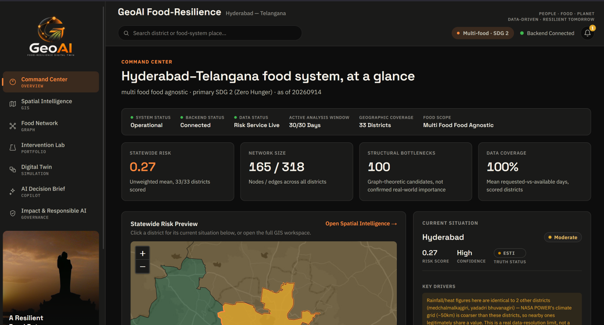
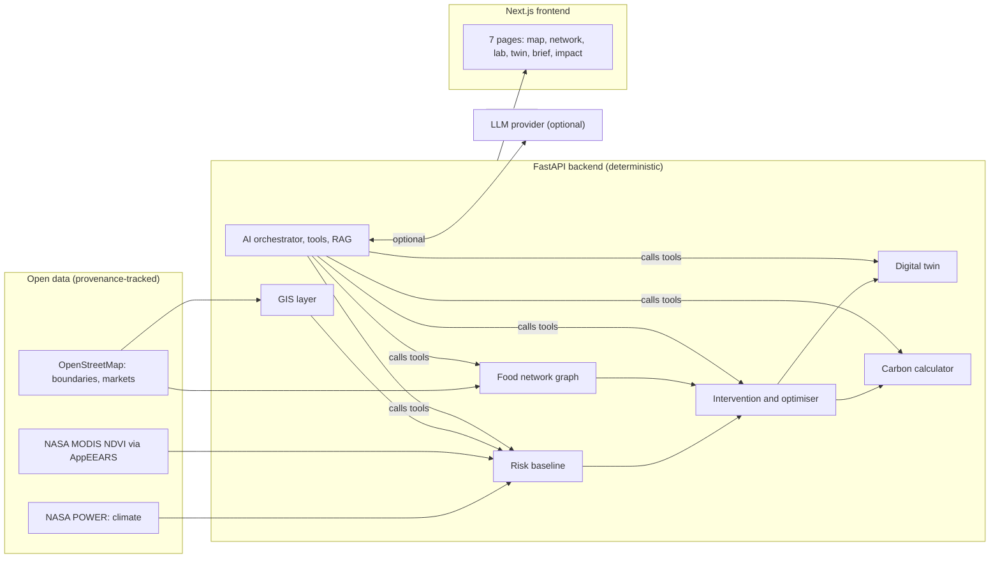
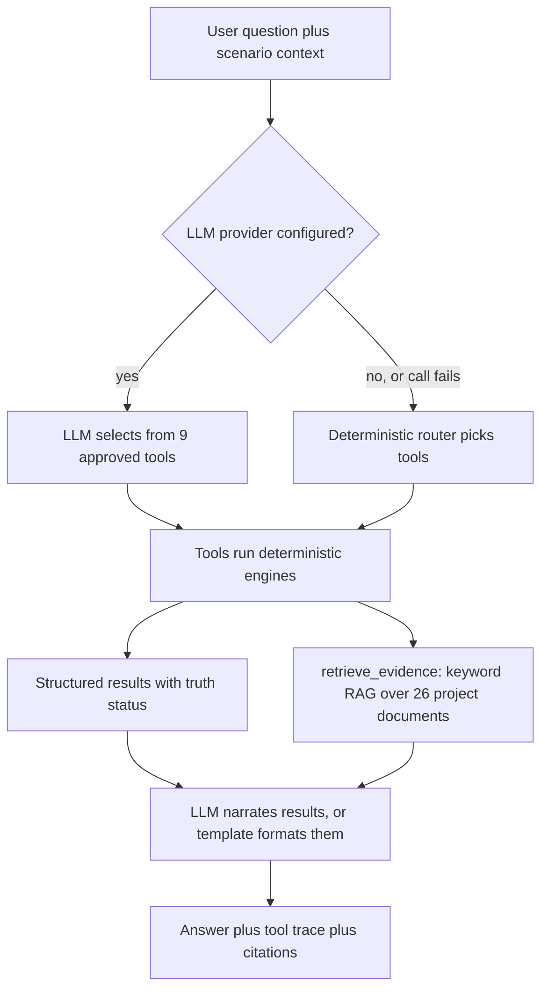

# GeoAI Food-Resilience Digital Twin — Project Submission

**1M1B AI for Sustainability Virtual Internship (July–Sep 2026)**
*In collaboration with IBM SkillsBuild & AICTE*

This document follows the deliverable structure of the internship's
*Project Creation & Guideline Document* (Section 8): Project Description,
Prototype/Demo, and Impact Statement, with the mandatory *Responsible AI
Considerations* section. For setup instructions, the tech stack and the
repository layout, see the root [README](../README.md).

| | |
|---|---|
| **Title** | GeoAI Food-Resilience Digital Twin |
| **Author** | Chepa Chaitanya Kireet — Project Creator / AI for Sustainability Intern |
| **College** | _[add college name]_ |
| **Primary SDG** | SDG 2 — Zero Hunger (nine secondary SDGs, see 1.3) |
| **Region** | Hyderabad–Telangana, India |
| **Project type** | Decision-support system + monitoring/analytical prototype (web platform) |
| **Repository** | <https://github.com/Chaitanyakireet/geoai-food-resilience-starter> |
| **Live demo** | <https://geoai-food-resilience.up.railway.app/> |
| **Release** | Git tag `v1.0-demo` (frozen demo baseline) |

---

## 1. Project Description

### 1.1 Title

**GeoAI Food-Resilience Digital Twin** — a GIS-centred decision-intelligence
platform for the Hyderabad–Telangana food system.

### 1.2 Name and college

- **Name:** Chepa Chaitanya Kireet
- **College:** _[add college name]_
- **Contact:** kireet.chepa@gmail.com ·
  [LinkedIn](https://www.linkedin.com/in/chepa-chaitanya-kireet-47672a2a1/) ·
  [GitHub](https://github.com/Chaitanyakireet)

### 1.3 SDG alignment

**Primary goal: SDG 2 — Zero Hunger.** The platform is about keeping food
available and accessible when climate stress or supply-chain disruption hits
a regional food system, which is the resilience side of ending hunger.

The guideline asks for *one main focus*; the platform keeps SDG 2 as the
single primary goal and declares nine secondary goals. Each goal is
classified **honestly** by whether a real output of the platform touches it
(this classification is also shown live on the *Impact & Responsible AI*
page, using the official UN SDG icons):

| SDG | Status | How it relates |
|---|---|---|
| **2 Zero Hunger** | **Directly modeled** | Climate-stress risk, food-network disruption propagation, and modeled food-availability effect of interventions. |
| **13 Climate Action** | **Directly modeled** | Rainfall-deficit and heat-stress risk from NASA POWER climate data; carbon impact of rerouting/sourcing interventions. |
| **9 Industry, Innovation & Infrastructure** | Co-benefit | Supply-network and infrastructure bottleneck analysis; transport-route diversification. |
| **11 Sustainable Cities & Communities** | Co-benefit | Hyderabad is modeled as the principal demand hub; urban food-system stability. |
| **6 Clean Water & Sanitation** | Scenario-dependent | Reads as a co-benefit only when a scenario supplies a water-impact value; otherwise *not modeled*. |
| **12 Responsible Consumption & Production** | Scenario-dependent | Reads as a co-benefit only when a scenario supplies a food-loss effect; otherwise *not modeled*. |
| **7, 8, 15, 17** | Not modeled | Declared as secondary goals, but no output currently touches them. The platform says so instead of claiming alignment. |

> This is a **project-alignment map, not proof of achievement**. No goal is
> scored numerically.

### 1.4 Problem statement

> **How might we use AI to help planners and food-system decision-makers in
> Hyderabad–Telangana sense climate stress, trace how a disruption spreads
> through the food supply network, and test interventions before committing
> resources — so that the regional food system can become more resilient and
> sustainable?**

**The problem.** Hyderabad depends on a wider regional network of
production areas, markets, storage and transport for its food. Climate
stress (low rainfall, heat) and disruptions to production, storage or
transport can cascade through that network. Decision-makers usually see
these signals in separate places — climate data in one, maps in another,
supply-chain knowledge in people's heads — and cannot easily ask "what
happens if this district's supply drops, and what would help most?"

**Who is affected.** Urban consumers in Hyderabad, farmers and market
traders in the districts that feed it, and the officials and organisations
responsible for food security and logistics across Telangana's 33 districts.

**Why the problem persists.**
- Climate, geography, supply-chain and intervention information sit in
  different tools and formats.
- Facility-level food data (warehouse capacity, trade volumes) is not openly
  available at scale, so much analysis stays informal.
- Planning tools that *do* exist are often black boxes; decision-makers
  cannot tell which numbers are measured and which are assumed.

**Current gap this project addresses.** A single, spatial, explainable
workspace that connects *sensing → risk → disruption tracing →
intervention testing → optimisation → simulation → explanation*, and that is
explicit about the epistemic status of every number.

### 1.5 AI solution overview

The platform is a seven-page web application backed by a deterministic
analytics API:

1. **Command Center** — state-level overview: mean risk, hotspots, network
   size, truth-status disclosure, and a risk map.
2. **Spatial Intelligence** — interactive GIS map of Telangana (state, 33
   districts, 593 mandals) with a risk layer, search, and a location panel
   that explains *why here?* (drivers, provenance, truth status).
3. **Food Network** — interactive graph of 165 nodes and 318 edges
   (production → aggregation → storage → market → demand) with structural
   bottleneck analysis and shock propagation.
4. **Intervention Lab** — compose a shock (production, storage, transport,
   market, climate), test interventions, simulate a portfolio, or run the
   optimiser; includes the carbon & resource impact panel.
5. **Digital Twin** — baseline / shock / intervention / optimised states,
   recovery trajectories, and **Compare Worlds** (World A vs World B).
6. **AI Decision Brief** — an AI Copilot that explains scenarios using
   deterministic tools and cites project evidence.
7. **Impact & Responsible AI** — SDG framework, confidence and data coverage,
   consolidated provenance, Responsible-AI checklist, and a human-review
   boundary.

#### Why AI is needed

| Need | Where AI helps |
|---|---|
| **Insight at scale** | Turning many data layers and simulation results into a short, readable brief for a non-technical decision-maker. |
| **Decision-making support** | An agentic copilot that picks the right analysis tools for a question instead of forcing the user through every screen. |
| **Information retrieval** | Retrieval-augmented answers that cite the project's own methodology and provenance rather than generic web knowledge. |

#### The central design rule: AI explains, code calculates

> **Deterministic tools calculate every number. The LLM can explain and
> orchestrate but cannot invent or override a numeric result.**

This is the core Responsible-AI decision of the project. The split is:

| Layer | Technique | AI? |
|---|---|---|
| Climate-stress **risk baseline** | Transparent weighted formula (rainfall deficit 0.6, heat stress 0.4) on NASA POWER anomalies vs a 2001–2020 baseline | No — deterministic, explicitly *not* a trained ML model |
| **Vegetation context** | MODIS NDVI, quality-filtered, vs same-season baseline (context only — *not* in the risk score) | No — observed data |
| **Food-network** analysis | Graph theory (NetworkX): articulation points, betweenness, in-degree; deterministic shock propagation | No |
| **Intervention / portfolio / optimiser** | Config-driven effects, multiplicative composition, brute-force multi-objective search with Pareto flags | No |
| **Digital Twin** | Deterministic exponential recovery model | No |
| **Carbon calculator** | Real distance × cited emissions factor × stated tonnage | No |
| **Copilot orchestration** | LLM tool-calling over 9 approved tools (Anthropic Claude via API key, optional) | **Yes** |
| **Evidence retrieval (RAG)** | Deterministic keyword-overlap retrieval over 26 project provenance/methodology documents | Retrieval component of RAG |
| **Narrative explanation** | LLM writes prose grounded in tool results, or a templated deterministic fallback when no LLM is configured | **Yes** (optional) |

**Agentic workflow.** The Copilot has nine approved tools:
`get_risk`, `inspect_location`, `inspect_food_graph`, `simulate_shock`,
`test_intervention`, `run_optimization`, `calculate_impact`,
`calculate_carbon_impact`, `retrieve_evidence`. The UI always shows the
**tool trace** (what ran, with what arguments, and the key results) beside
the answer, plus **citation cards** for every retrieved evidence item.

**Works with no AI provider.** If no `ANTHROPIC_API_KEY` is set, the whole
application still works: the Copilot and Decision Brief fall back to a
templated, deterministic summary of the same tool results, clearly labeled as
a "structured system brief" rather than AI-generated prose.

**Prompt engineering.** The Copilot's system prompt (in
`backend/ai/orchestrator.py`) instructs the model to ground every numeric
claim in a tool result, always state the truth status, never call an
estimated/simulated value "observed", never claim field validation, and say
explicitly when retrieval finds no evidence.

> **Development note (transparency).** The project was built with AI coding
> assistants (Claude and ChatGPT) working under the author's direction, as
> recorded in `docs/MASTER_HANDOFF.md`; the author set the scope, made the
> design decisions, and approved every milestone.

### 1.6 Target users

| User | What they would use it for |
|---|---|
| **Regional food-security & district planners** | Spot climate-stressed districts, see where supply depends on few nodes, and compare candidate responses. |
| **Supply-chain / logistics & market managers** | Explore how a transport or storage disruption propagates and which reroutes reduce impact — with a carbon estimate for the reroute. |
| **Climate & agriculture policy analysts** | Inspect drivers behind a risk score, with data provenance and limits. |
| **NGOs, researchers and students** | A transparent, reproducible reference for AI + GIS decision support and for how to label evidence honestly. |

> The platform is a prototype built from open data. It has **not** been
> user-tested with real planners; the users above are the intended audience.

### 1.7 Responsible AI considerations

*(The guideline's four mandatory pillars, plus the limitations that matter
for interpreting results.)*

#### Fairness — avoid bias in data or assumptions

- **No personal or demographic data** is used, so there is no individual-level
  bias to learn. Every district is scored by the same formula.
- **Assumptions are disclosed, not hidden.** Risk weights, intervention
  effectiveness defaults and the resilience target are labeled **ESTIMATED**,
  documented in `config/*.yaml`, and stated as *not fitted to outcome data*
  (none exists for Telangana).
- **Known blind spots are surfaced.** The state mean is an *unweighted*
  average — it is not population- or production-weighted, so it can
  under-represent densely populated or vulnerable areas. Vulnerability,
  income and nutrition are not modeled.
- **Data-resolution bias is disclosed in-app.** NASA POWER's ~50 km grid means
  nearby districts can share identical rainfall/heat readings; the UI names
  the districts that share a climate-grid cell and states that this is a data
  limit, not a computation error.
- Mandal-level results are **inherited from the parent district** and flagged
  as such — mandal precision is never implied.

#### Transparency — explain how AI reaches outcomes

- **Five truth-status labels** appear wherever a value is shown, and nothing
  else is allowed: `OBSERVED`, `DERIVED`, `ESTIMATED`, `COUNTERFACTUAL`,
  `SIMULATED`. Estimated/simulated values are never presented as measured.
- **Provenance everywhere.** Seven provenance endpoints (GIS, risk, graph,
  interventions, optimisation, twin, AI) are aggregated on the Impact page;
  every dataset lists source, access date, licence, processing and
  limitations. Sources that were sought but *not* obtained (e.g. AGMARKNET,
  FCI warehousing, state production statistics) are listed too.
- **Visible reasoning.** The tool trace and evidence citations sit beside every
  Copilot answer; the optimiser's own "why this portfolio?" explanation is
  shown without an LLM; a "Why here?" panel explains each map result.
- **Reproducible.** Deterministic calculations, versioned configs, scripts to
  regenerate every processed dataset, and 246 automated tests.

#### Ethics — no harmful, discriminatory, or misleading use

- **No unsupported causal or carbon claims.** Carbon results use one real,
  cited factor (UK BEIS/DEFRA 2021 road freight). Because that is a **UK
  proxy**, the distance is **straight-line**, and tonnage is a user
  assumption, every result is labeled ESTIMATED and carries those
  disclosures. Storage/cold-chain carbon is reported as **not modeled**
  rather than invented.
- **No fabrication.** Missing data yields "unavailable" or "not modeled",
  never a plausible-looking number. Nothing in the food graph carries an
  invented facility capacity or trade volume; placeholder nodes are labeled
  `SIMULATED`.
- **Grounded evidence only.** Evidence retrieval reports `found: false` when
  nothing matches — and a QA pass fixed a bug where generic filler words could
  cause a spurious match.
- **Human in the loop.** The platform supports decisions; it does not make
  them. A Human Review panel marks the boundary — and states plainly that its
  "reviewed" toggle is local browser state, not institutional approval.
  Intervention effectiveness values are illustrative assumptions and no
  intervention is claimed to be field-validated.
- **Attribution.** UN SDG icons are unmodified and carry the UN's required
  disclaimer; the sidebar photograph is credited (CC BY-SA 3.0).

#### Privacy — avoid personal or sensitive data misuse

- **No personal data is collected or processed.** There are no user accounts,
  no analytics or tracking, and no user-entered personal information.
- All inputs are public, aggregate data (administrative boundaries, gridded
  climate, satellite vegetation index, public marketplace points of interest).
- **Secrets stay server-side.** The LLM API key is read only from an
  environment variable and is never returned in any API response; `.env` is
  git-ignored and `.env.example` is blank.
- The only personal information in the product is the author's own *public*
  contact links in the footer.

### 1.8 Expected impact

**What changes if this approach is adopted.** Food-system planning moves from
scattered, opaque, one-off analysis to a shared spatial workspace where risk,
disruption paths, candidate interventions and their trade-offs (including
carbon) can be examined in minutes, with the evidence trail attached.

**Who benefits, and how.**
- **Planners and logistics managers** — faster identification of climate-
  stressed districts and structural bottlenecks; a way to compare responses
  before spending.
- **Communities that depend on the network** — indirectly, through earlier
  attention to fragile supply links and better-targeted, lower-carbon
  reroutes.
- **The wider AI-for-sustainability community** — a worked example of AI
  decision support that keeps calculation deterministic and labels the
  status of every number.

> **Honest scope.** The outputs are **decision-support scenarios, not
> validated real-world forecasts.** The impact described is *potential*
> impact of the approach; no real-world deployment outcome is claimed.

---

## 2. Prototype / Demo

The prototype is a working, deployed web application (see the table at the
top for the release tag and demo link). Below: a screenshot, flow diagrams,
the demo walkthrough, and sample inputs/outputs.

<p align="center">
  <a href="https://geoai-food-resilience.up.railway.app/"></a>
</p>
<p align="center"><em>Command Center of the deployed application (click to open the live demo).</em></p>

### 2.1 System architecture



### 2.2 The numerical chain and core loop


Every arrow up to *Verify* is deterministic code; only *Explain* involves an
LLM, and it may only narrate results the earlier stages produced.

### 2.3 AI agent and RAG logic



### 2.4 Demo walkthrough (the path used for the final validation)

1. **Command Center** — mean risk, hotspots, truth-status disclosure.
2. **Spatial Intelligence** — click a district or search "Secunderabad" /
   "Quthbullapur"; read the *Why here?* panel, NDVI context and provenance.
3. **Food Network** — select a node, apply a shock, watch the propagation.
4. **Intervention Lab** — compose a shock, add interventions, **Simulate** or
   **Optimise**; open *Carbon & Resource Impact*.
5. **Digital Twin** — run the scenario, view recovery, press **Compare Worlds**.
6. **AI Decision Brief** — generate the brief; inspect the tool trace and
   citations.
7. **Impact & Responsible AI** — SDG framework, confidence, provenance,
   Responsible-AI checklist, human review.

### 2.5 Sample inputs and outputs (from the committed data snapshot)

**Risk (deterministic, ESTIMATED).**
`GET /risk?geo_id=khammam` →
`risk_class: low`, `risk_score: 0.1489`, `truth_status: ESTIMATED`; drivers
include rainfall deficit and heat stress (used in score) and
`vegetation_condition` (NDVI, `OBSERVED`, **not** used in score).

**Carbon (deterministic).** Reroute 12 t from Hyderabad to Khammam:

```
distance      = 201.78 km        (great-circle between district centroids, DERIVED)
factor        = 0.04401 kg CO2e per tonne-km   (UK BEIS/DEFRA 2021, HGV rigid >17 t, avg laden, WTW)
intensity     = 201.78 x 0.04401 = 8.8803 kg/tonne
scenario      = 8.8803 x 12      = 106.564 kg CO2e   (ESTIMATED: tonnage is an assumption)
baseline      = 0 kg             (no intervention -> no added transport, by definition)
delta         = +106.564 kg      (% change undefined from a zero baseline, so not shown)
```

Requesting the storage/cold-chain factor instead returns
`available: false` with the reason "not_modeled" — no number is invented.

**Digital Twin, Compare Worlds** (Hyderabad, 50 % production shock,
*alternative sourcing*): demand impact −0.0227, resilience score +0.0093,
recovery time −7 days versus the no-intervention world — all `SIMULATED`,
with cost/water/carbon shown only if the user supplied them.

**Copilot with no LLM configured.** The answer text is a direct template of
the tool result (`inspect_location` → risk class, score, resilience score,
truth statuses) — the numbers match the tool trace exactly.

### 2.6 Testing

- **246 backend tests** (pytest) cover GIS, risk, graph, interventions,
  optimisation, twin, AI grounding/fallback, and carbon (arithmetic, units,
  missing-factor, provenance, edge cases, API).
- Frontend `tsc`, ESLint and a production build are clean.
- Data integrity checks: 33 districts, 593 mandals, 1 state geometry (all
  EPSG:4326, valid), 165 graph nodes, 318 edges.

---

## 3. Project journey (mapped to the guideline)

### Design-thinking stages

| Stage | What was done |
|---|---|
| **Empathize** | Framed the problem from a local system the author knows: Hyderabad's dependence on regional food supply and exposure to climate stress. Identified planners, logistics managers and analysts as the people who face fragmented information. |
| **Define** | Problem statement (1.4); target users (1.6); gap = no single, explainable, spatial tool that separates measured from assumed. |
| **Ideate** | Considered a chatbot, a dashboard, or a full decision-support twin. Chose a twin with a *deterministic core* and an *AI explanation layer*, so the AI adds insight without owning the numbers. |
| **Prototype** | Built the pipeline (GIS → risk → graph → interventions → optimiser → twin → AI), the seven-page UI, and the flow diagrams above. |
| **Test & refine** | Automated tests, a full QA sweep, an independent AI "red-team" review role defined in the project handoff (the guideline's mentor-feedback step should be added here once mentor comments are received), and fixes for real defects (e.g. the evidence-retrieval false-positive, the zoom-control overlay bug, double-scaled NDVI values). |

### Project Making Journey (guideline's eight stages)

| Guideline stage | In this project |
|---|---|
| Problem identification | Regional food-system fragility under climate stress. |
| SDG alignment | SDG 2 primary; honest classification of nine secondary SDGs. |
| AI role & ideation | AI as explainer/orchestrator; deterministic tools for numbers. |
| Design thinking | Stages above. |
| Design thinking (iteration) | Repeated scope-lock, review and simplification cycles (see `docs/MASTER_HANDOFF.md`). |
| Prototype & testing | Deployed web app, 246 tests, data-integrity checks. |
| Impact & evaluation | Impact page, SDG framework, confidence/data-coverage, carbon impact. |
| Responsible AI & ethics | Section 1.7; truth-status system; provenance; human review. |

---

## 4. Impact statement

**If this solution were adopted,** planners would be able to move from
"we think this district is at risk" to a traceable chain: *measured climate
stress → modeled risk → simulated disruption through the food network →
tested interventions → modeled recovery → an evidence-cited explanation* —
while always knowing which numbers were measured and which were assumed.

**Who benefits:** planners and logistics managers (faster, better-informed
decisions), communities that rely on the network (earlier attention to weak
links; lower-carbon reroutes), and the AI-for-sustainability community (a
reproducible pattern for responsible decision support).

**What it does not claim:** it is not a validated forecast, it does not
replace local knowledge or official data, and no intervention is claimed to
be proven in the field.

---

## 5. Limitations and future work

**Known limitations (disclosed in the application too):**
- Risk is a **transparent baseline, not a trained model** — no historical
  food-disruption ground truth exists to fit or validate against.
- Climate features are computed at **33 district centroids** on NASA POWER's
  ~50 km grid; mandal risk is inherited from its district.
- Food-graph **production, aggregation, storage and most demand nodes are
  derived or simulated**; only market nodes use real OSM data (29 of 33
  districts). No edge carries a real flow volume or capacity.
- NDVI is shown as **context** and is **not** folded into the risk score (no
  validated weighting).
- Carbon uses a **UK factor as a proxy**, **straight-line distance** and an
  **assumed tonnage**; **storage/cold-chain carbon is not modeled**.
- Intervention effectiveness values are **illustrative assumptions**.
- The Copilot's LLM adapter currently targets Anthropic's API; IBM Granite or
  other providers are not integrated (the provider layer is isolated in
  `backend/ai/provider.py`, so another adapter can be added).
- Not yet tested with real end-users.

**Future work (not implemented):** validated risk calibration against
historical disruption data; facility-level supply data (AGMARKNET/e-NAM, FCI,
state statistics) if obtained; India-specific freight and cold-chain emission
factors; road-network routing; population-weighted aggregation; additional
LLM providers; user testing with planners.

---

## 6. Data sources and attribution

| Source | Used for | Notes |
|---|---|---|
| OpenStreetMap (Overpass / Nominatim) | Telangana boundaries (33 districts, 593 mandals), marketplace points of interest | © OpenStreetMap contributors, ODbL. Used because the preferred state source (TGRAC) was unreachable — documented in provenance. |
| NASA POWER | Daily/monthly climate (T2M, T2M_MAX, PRECTOTCORR), 2001–2020 baseline | Public domain, cite NASA POWER; ~0.5° native grid. |
| NASA LP DAAC MOD13Q1.061 via AppEEARS | NDVI vegetation context | Public-domain NASA data; Earthdata Login required to refresh. |
| UK Government BEIS/DEFRA GHG Conversion Factors 2021 | Road-freight emissions factor | UK proxy; see carbon disclosures. |
| United Nations — Sustainable Development Goals | Official SDG icons (unmodified) | Required UN disclaimer shown in-app. |
| Esri World Dark Gray Base | Map basemap tiles | Attribution shown on the map. |
| "Sunset at Hussain Sagar" by Lakshayreddy, Wikimedia Commons | Sidebar photograph | CC BY-SA 3.0, credited in the sidebar. |

Full per-dataset provenance (access dates, processing, limitations) is served
live by the API and rendered on the *Impact & Responsible AI* page.
